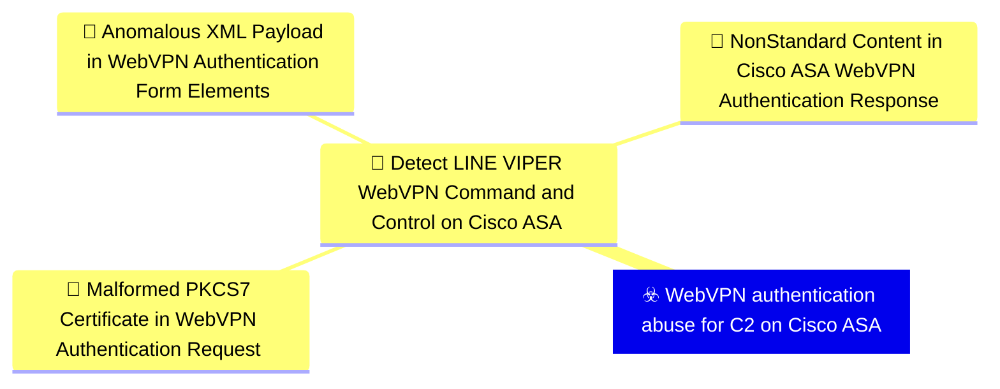
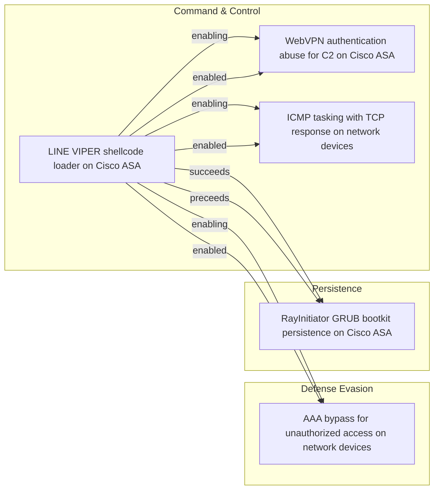

# ☣️ WebVPN authentication abuse for C2 on Cisco ASA

🔥 **Criticality:High** ⚠️ : A High priority incident is likely to result in a demonstrable impact to public health or safety, national security, economic security, foreign relations, civil liberties, or public confidence. 

🚦 **TLP:CLEAR** ⚪ : Recipients can spread this to the world, there is no limit on disclosure.

🗡️ **ATT&CK Techniques** [T1071.001 : Application Layer Protocol: Web Protocols](https://attack.mitre.org/techniques/T1071/001 'Adversaries may communicate using application layer protocols associated with web traffic to avoid detectionnetwork filtering by blending in with exis'), [T1573.001 : Encrypted Channel: Symmetric Cryptography](https://attack.mitre.org/techniques/T1573/001 'Adversaries may employ a known symmetric encryption algorithm to conceal command and control traffic rather than relying on any inherent protections p'), [T1573.002 : Encrypted Channel: Asymmetric Cryptography](https://attack.mitre.org/techniques/T1573/002 'Adversaries may employ a known asymmetric encryption algorithm to conceal command and control traffic rather than relying on any inherent protections '), [T1090 : Proxy](https://attack.mitre.org/techniques/T1090 'Adversaries may use a connection proxy to direct network traffic between systems or act as an intermediary for network communications to a command and')

---

`🔑 UUID : fcc552fb-b4d1-4b47-b366-104ec4d806ef` **|** `🏷️ Version : 1` **|** `🗓️ Creation Date : 2026-06-18` **|** `🗓️ Last Modification : 2026-06-18` **|** `Sharing Organisation : {'uuid': '56b0a0f0-b0bc-47d9-bb46-02f80ae2065a', 'name': 'EC DIGIT CSOC'}` **|** `🧱 Schema Identifier : tvm::2.1`

## 👁️ Description

> LINE VIPER implements a sophisticated command and control mechanism
> that abuses legitimate WebVPN client authentication functionality on
> Cisco ASA devices [1]. This technique allows attackers to task the
> malware and exfiltrate data while blending with normal VPN
> authentication traffic.
> 
> #### Deployment Mechanism
> 
> LINE VIPER is initially loaded into memory through a specially
> crafted WebVPN client authentication request. The request contains
> a partial PKCS7 certificate followed by shellcode, which is
> processed by a handler installed in the lina binary by the
> RayInitiator bootkit [1].
> 
> #### Communication Protocol
> 
> The WebVPN-based C2 channel uses HTTPS to communicate with the
> compromised device. The protocol leverages standard WebVPN
> authentication endpoints, making malicious traffic difficult to
> distinguish from legitimate VPN authentication attempts [1].
> 
> **Request Structure:** Tasking commands are delivered through HTTP
> POST requests to the WebVPN endpoint with carefully crafted XML
> payloads. The requests include standard WebVPN headers such as
> X-Transcend-Version, X-Aggregate-Auth, and Content-Type set to
> application/x-www-form-urlencoded [1].
> 
> Example request format includes:
> - XML version declaration
> - config-auth element with client="vpn" and type="init"
> - aggregate-auth-version="2"
> - version, device-id, and platform information
> - mac-address-list elements
> - opaque section containing tunnel-group and authentication details
> 
> The tasking data is embedded within device-type or similar fields
> in the XML structure [1].
> 
> **Response Structure:** Actor tasking responses return HTTP 200 OK
> status with XML content. The response includes standard security
> headers (X-Frame-Options, Strict-Transport-Security,
> X-Content-Type-Options, X-XSS-Protection, Content-Security-Policy)
> and the tasking response data embedded in the message element of
> the XML [1].
> 
> #### Encryption and Authentication
> 
> LINE VIPER implements multiple layers of cryptographic protection
> for its C2 communications [1]:
> 
> - **Per-Victim RSA Keys:** Each compromised device uses a unique
>   RSA public key for asymmetric cryptography. This key is used to
>   perform symmetric key exchange operations, ensuring that only the
>   actor with the corresponding private key can task the device.
> 
> - **Per-Request AES Encryption:** Tasking commands are encrypted
>   using AES with a unique symmetric key for each request. This
>   provides an additional layer of encryption beyond HTTPS and
>   prevents replay attacks.
> 
> - **Victim-Specific Tokens:** Tasking payloads sent to victim
>   devices are validated against multiple victim-specific tokens
>   before execution. This environmental keying ensures that captured
>   tasking commands cannot be replayed against different devices.
> 
> #### Operational Security
> 
> The abuse of WebVPN authentication for C2 provides several
> operational security benefits to the attacker [1]:
> 
> - **Traffic Blending:** C2 traffic appears as legitimate WebVPN
>   authentication attempts, making it difficult to identify through
>   network monitoring.
> 
> - **Encrypted Channel:** HTTPS encryption provides a legitimate
>   encrypted channel that network security devices typically allow.
> 
> - **No Unusual Ports:** Communication uses standard HTTPS port 443,
>   avoiding the need for unusual firewall rules or exceptions.
> 
> - **Expected Behaviour:** WebVPN authentication attempts are
>   expected traffic for ASA devices, reducing suspicion during
>   investigation.
> 
> This technique demonstrates sophisticated understanding of Cisco ASA
> WebVPN implementation and represents a significant advancement in
> C2 channel design for network device implants. The use of
> legitimate functionality for malicious purposes makes detection
> challenging and requires deep packet inspection or behavioural
> analysis beyond standard network monitoring.
> 

## 🖥️ Terrain 

 > Cisco ASA devices with WebVPN functionality enabled and accessible
> to attacker infrastructure [1]. The WebVPN client authentication
> mechanism processes XML data containing device-id, version, and form
> elements through a large codebase in lina. This XML processing does
> not adequately validate or sanitise crafted authentication requests,
> allowing arbitrary data to be embedded in standard authentication
> fields like device-type within the XML structure.
> 

---

## 🕸️ Relations

### 🌊 OpenTide Objects

 **Descendants** 

| 🎯 Detection Objectives                                                                                                                                                                                                                                                                                                                | 📡 Detection Objective Signals (3)                                                                                                                                                                                                                                                                                                                                                                                                                                                                                                                                                                                                                                                                                                                                                                                                                                                                                                                                                                                                                                                                                                                                                                                                                                                                                      | 🛡️ Detection Models    | 🚨 Detection Rules    |
|:--------------------------------------------------------------------------------------------------------------------------------------------------------------------------------------------------------------------------------------------------------------------------------------------------------------------------------------|:-----------------------------------------------------------------------------------------------------------------------------------------------------------------------------------------------------------------------------------------------------------------------------------------------------------------------------------------------------------------------------------------------------------------------------------------------------------------------------------------------------------------------------------------------------------------------------------------------------------------------------------------------------------------------------------------------------------------------------------------------------------------------------------------------------------------------------------------------------------------------------------------------------------------------------------------------------------------------------------------------------------------------------------------------------------------------------------------------------------------------------------------------------------------------------------------------------------------------------------------------------------------------------------------------------------------------|:-----------------------|:---------------------|
| [Detect LINE VIPER WebVPN Command and Control on Cisco ASA](../Detection%20Objectives/🎯%20Detect%20LINE%20VIPER%20WebVPN%20Command%20and%20Control%20on%20Cisco%20ASA.md 'This detection objective targets the WebVPN-based command and controlchannel used by the LINE VIPER implant on compromised Cisco ASAdevices LINE VIPER...') | [Detect LINE VIPER WebVPN Command and Control on Cisco ASA::Malformed PKCS7 Certificate in WebVPN Authentication Request](Detect%20LINE%20VIPER%20WebVPN%20Command%20and%20Control%20on%20Cisco%20ASA#malformed-pkcs7-certificate-in-webvpn-authentication-request.md 'Detects WebVPN client authentication requests to a Cisco ASAdevice where the certificate field contains a malformed orpartial PKCS7 structure, consist...') [Detect LINE VIPER WebVPN Command and Control on Cisco ASA::Non-Standard Content in Cisco ASA WebVPN Authentication Response](Detect%20LINE%20VIPER%20WebVPN%20Command%20and%20Control%20on%20Cisco%20ASA#non-standard-content-in-cisco-asa-webvpn-authentication-response.md 'Detects Cisco ASA WebVPN authentication responses that embeddata in the XML message element in a manner inconsistent withlegitimate authentication out...') [Detect LINE VIPER WebVPN Command and Control on Cisco ASA::Anomalous XML Payload in WebVPN Authentication Form Elements](Detect%20LINE%20VIPER%20WebVPN%20Command%20and%20Control%20on%20Cisco%20ASA#anomalous-xml-payload-in-webvpn-authentication-form-elements.md 'Detects WebVPN authentication requests where standard XML formelements carry anomalously large, encoded, or encrypted payloadsinconsistent with legiti...') | ❌ No Detection Models  | ❌ No Detection Rules |

 --- 

### ⛓️ Threat Chaining

Expand chaining data

| ☣️ Vector                                                                                                                                                                                                                                                                                                            | ⛓️ Link              | 🎯 Target                                                                                                                                                                                                                                                                                                             | ⛰️ Terrain                                                                                                                                                                                                                                                                                                                                                                                                                                                            | 🗡️ ATT&CK                                                                                                                                                                                                                                                                                                                                                                                                                                                                                                                                                                                                                                                                                                                                                                                                                                                                                                                                                                                                                                                                                                                                                                                                                                                                                                                                                                                                                                                                                                         |
|:---------------------------------------------------------------------------------------------------------------------------------------------------------------------------------------------------------------------------------------------------------------------------------------------------------------------|:---------------------|:---------------------------------------------------------------------------------------------------------------------------------------------------------------------------------------------------------------------------------------------------------------------------------------------------------------------|:----------------------------------------------------------------------------------------------------------------------------------------------------------------------------------------------------------------------------------------------------------------------------------------------------------------------------------------------------------------------------------------------------------------------------------------------------------------------|:------------------------------------------------------------------------------------------------------------------------------------------------------------------------------------------------------------------------------------------------------------------------------------------------------------------------------------------------------------------------------------------------------------------------------------------------------------------------------------------------------------------------------------------------------------------------------------------------------------------------------------------------------------------------------------------------------------------------------------------------------------------------------------------------------------------------------------------------------------------------------------------------------------------------------------------------------------------------------------------------------------------------------------------------------------------------------------------------------------------------------------------------------------------------------------------------------------------------------------------------------------------------------------------------------------------------------------------------------------------------------------------------------------------------------------------------------------------------------------------------------------------|
| [LINE VIPER shellcode loader on Cisco ASA](../Threat%20Vectors/☣️%20LINE%20VIPER%20shellcode%20loader%20on%20Cisco%20ASA.md 'LINE VIPER is a sophisticated user-mode shellcode loader withassociated modules that targets Cisco ASA Adaptive SecurityAppliance devices It represent...')                             | `support::enabling`  | [WebVPN authentication abuse for C2 on Cisco ASA](../Threat%20Vectors/☣️%20WebVPN%20authentication%20abuse%20for%20C2%20on%20Cisco%20ASA.md 'LINE VIPER implements a sophisticated command and control mechanismthat abuses legitimate WebVPN client authentication functionality onCisco ASA devic...')             | Cisco ASA devices with WebVPN functionality enabled and accessible to attacker infrastructure [1]. The WebVPN client authentication mechanism processes XML data containing device-id, version, and form elements through a large codebase in lina. This XML processing does not adequately validate or sanitise crafted authentication requests, allowing arbitrary data to be embedded in standard authentication fields like device-type within the XML structure. | [T1071.001 : Application Layer Protocol: Web Protocols](https://attack.mitre.org/techniques/T1071/001 'Adversaries may communicate using application layer protocols associated with web traffic to avoid detectionnetwork filtering by blending in with exis'), [T1573.001 : Encrypted Channel: Symmetric Cryptography](https://attack.mitre.org/techniques/T1573/001 'Adversaries may employ a known symmetric encryption algorithm to conceal command and control traffic rather than relying on any inherent protections p'), [T1573.002 : Encrypted Channel: Asymmetric Cryptography](https://attack.mitre.org/techniques/T1573/002 'Adversaries may employ a known asymmetric encryption algorithm to conceal command and control traffic rather than relying on any inherent protections '), [T1090 : Proxy](https://attack.mitre.org/techniques/T1090 'Adversaries may use a connection proxy to direct network traffic between systems or act as an intermediary for network communications to a command and')                                                                                                                                                                                                                                                                                                                                                                                                                                                                                           |
| [LINE VIPER shellcode loader on Cisco ASA](../Threat%20Vectors/☣️%20LINE%20VIPER%20shellcode%20loader%20on%20Cisco%20ASA.md 'LINE VIPER is a sophisticated user-mode shellcode loader withassociated modules that targets Cisco ASA Adaptive SecurityAppliance devices It represent...')                             | `support::enabling`  | [ICMP tasking with TCP response on network devices](../Threat%20Vectors/☣️%20ICMP%20tasking%20with%20TCP%20response%20on%20network%20devices.md 'LINE VIPER implements a sophisticated alternative command andcontrol mechanism that uses ICMP Internet Control Message Protocolfor receiving tasking c...')         | Network configurations where ICMP traffic is permitted to reach Cisco ASA LAN interfaces, particularly through established VPN tunnels [1]. In observed operations, ICMP tasking is not sent to the WAN interface but instead tunnelled through an established VPN session to a LAN interface. The VPN connection allows actor- controlled systems within the local network to send ICMP Echo Requests that bypass traditional WAN-focused network monitoring.        | [T1095](https://attack.mitre.org/techniques/T1095 'Adversaries may use an OSI non-application layer protocol for communication between host and C2 server or among infected hosts within a network The li'), [T1571](https://attack.mitre.org/techniques/T1571 'Adversaries may communicate using a protocol and port pairing that are typically not associated For example, HTTPS over port 8088Citation Symantec Elf'), [T1573.001](https://attack.mitre.org/techniques/T1573/001 'Adversaries may employ a known symmetric encryption algorithm to conceal command and control traffic rather than relying on any inherent protections p'), [T1573.002](https://attack.mitre.org/techniques/T1573/002 'Adversaries may employ a known asymmetric encryption algorithm to conceal command and control traffic rather than relying on any inherent protections '), [T1480.001](https://attack.mitre.org/techniques/T1480/001 'Adversaries may environmentally key payloads or other features of malware to evade defenses and constraint execution to a specific target environment ')                                                                                                                                                                                                                                                                                                                                                                                                                           |
| [LINE VIPER shellcode loader on Cisco ASA](../Threat%20Vectors/☣️%20LINE%20VIPER%20shellcode%20loader%20on%20Cisco%20ASA.md 'LINE VIPER is a sophisticated user-mode shellcode loader withassociated modules that targets Cisco ASA Adaptive SecurityAppliance devices It represent...')                             | `support::enabling`  | [AAA bypass for unauthorized access on network devices](../Threat%20Vectors/☣️%20AAA%20bypass%20for%20unauthorized%20access%20on%20network%20devices.md 'LINE VIPER implements a critical capability to bypassAuthentication, Authorization, and Accounting AAA mechanisms oncompromised Cisco ASA devices 1 Th...') | Cisco ASA devices with LINE VIPER malware deployed that has memory- resident hooks in the lina binary [1]. The malware operates with sufficient privileges to modify AAA processing logic at runtime, intercepting authentication requests before they reach legitimate AAA validation routines. This requires prior compromise through bootkit deployment that provides the necessary execution context and privileges.                                              | [T1562.001 : Impair Defenses: Disable or Modify Tools](https://attack.mitre.org/techniques/T1562/001 'Adversaries may modify andor disable security tools to avoid possible detection of their malwaretools and activities This may take many forms, such as'), [T1562 : Impair Defenses](https://attack.mitre.org/techniques/T1562 'Adversaries may maliciously modify components of a victim environment in order to hinder or disable defensive mechanisms This not only involves impair'), [T1556 : Modify Authentication Process](https://attack.mitre.org/techniques/T1556 'Adversaries may modify authentication mechanisms and processes to access user credentials or enable otherwise unwarranted access to accounts The authe'), [T1550 : Use Alternate Authentication Material](https://attack.mitre.org/techniques/T1550 'Adversaries may use alternate authentication material, such as password hashes, Kerberos tickets, and application access tokens, in order to move late')                                                                                                                                                                                                                                                                                                                                                                                                                                                                                                                   |
| [LINE VIPER shellcode loader on Cisco ASA](../Threat%20Vectors/☣️%20LINE%20VIPER%20shellcode%20loader%20on%20Cisco%20ASA.md 'LINE VIPER is a sophisticated user-mode shellcode loader withassociated modules that targets Cisco ASA Adaptive SecurityAppliance devices It represent...')                             | `sequence::succeeds` | [RayInitiator GRUB bootkit persistence on Cisco ASA](../Threat%20Vectors/☣️%20RayInitiator%20GRUB%20bootkit%20persistence%20on%20Cisco%20ASA.md 'RayInitiator is a sophisticated persistent multi-stage bootkit thatfacilitates the deployment of LINE VIPER malware to Cisco ASAAdaptive Security Appl...')         | Cisco ASA 5500-X series devices without secure boot technology, lacking cryptographic verification of early boot software [1]. These models were released in 2012 with an End of Life notice issued by Cisco in 2020. All observed targeted models have either passed their last day of support or reach end of support September 30, 2025 [1]. The absence of secure boot allows arbitrary modification of the GRUB bootloader without cryptographic validation.     | [T1542.003 : Pre-OS Boot: Bootkit](https://attack.mitre.org/techniques/T1542/003 'Adversaries may use bootkits to persist on systems A bootkit is a malware variant that modifies the boot sectors of a hard drive, allowing malicious c'), [T1601.001 : Modify System Image: Patch System Image](https://attack.mitre.org/techniques/T1601/001 'Adversaries may modify the operating system of a network device to introduce new capabilities or weaken existing defensesCitation Killing the myth of '), [T1542.001 : Pre-OS Boot: System Firmware](https://attack.mitre.org/techniques/T1542/001 'Adversaries may modify system firmware to persist on systemsThe BIOS Basic InputOutput System and The Unified Extensible Firmware Interface UEFI or Ex')                                                                                                                                                                                                                                                                                                                                                                                                                                                                                                                                                                                                                                                                                                                                                     |
| [RayInitiator GRUB bootkit persistence on Cisco ASA](../Threat%20Vectors/☣️%20RayInitiator%20GRUB%20bootkit%20persistence%20on%20Cisco%20ASA.md 'RayInitiator is a sophisticated persistent multi-stage bootkit thatfacilitates the deployment of LINE VIPER malware to Cisco ASAAdaptive Security Appl...')         | `sequence::preceeds` | [LINE VIPER shellcode loader on Cisco ASA](../Threat%20Vectors/☣️%20LINE%20VIPER%20shellcode%20loader%20on%20Cisco%20ASA.md 'LINE VIPER is a sophisticated user-mode shellcode loader withassociated modules that targets Cisco ASA Adaptive SecurityAppliance devices It represent...')                             | Compromised Cisco ASA devices running firmware versions 9.12(4)67 and 9.14(4)24, which were fully patched at time of discovery [1]. Requires prior deployment of RayInitiator bootkit which installs hooks into lina binary to intercept WebVPN XML form element processing. The WebVPN traffic handling codebase in lina processes XML data that can be weaponised to load shellcode when specific form elements are encountered.                                    | [T1059.008](https://attack.mitre.org/techniques/T1059/008 'Adversaries may abuse scripting or built-in command line interpreters CLI on network devices to execute malicious command and payloads The CLI is the '), [T1014](https://attack.mitre.org/techniques/T1014 'Adversaries may use rootkits to hide the presence of programs, files, network connections, services, drivers, and other system components Rootkits are'), [T1562.001](https://attack.mitre.org/techniques/T1562/001 'Adversaries may modify andor disable security tools to avoid possible detection of their malwaretools and activities This may take many forms, such as'), [T1562](https://attack.mitre.org/techniques/T1562 'Adversaries may maliciously modify components of a victim environment in order to hinder or disable defensive mechanisms This not only involves impair'), [T1202](https://attack.mitre.org/techniques/T1202 'Adversaries may abuse utilities that allow for command execution to bypass security restrictions that limit the use of command-line interpreters Vario'), [T1040](https://attack.mitre.org/techniques/T1040 'Adversaries may passively sniff network traffic to capture information about an environment, including authentication material passed over the network'), [T1480.001](https://attack.mitre.org/techniques/T1480/001 'Adversaries may environmentally key payloads or other features of malware to evade defenses and constraint execution to a specific target environment ') |
| [ICMP tasking with TCP response on network devices](../Threat%20Vectors/☣️%20ICMP%20tasking%20with%20TCP%20response%20on%20network%20devices.md 'LINE VIPER implements a sophisticated alternative command andcontrol mechanism that uses ICMP Internet Control Message Protocolfor receiving tasking c...')         | `support::enabled`   | [LINE VIPER shellcode loader on Cisco ASA](../Threat%20Vectors/☣️%20LINE%20VIPER%20shellcode%20loader%20on%20Cisco%20ASA.md 'LINE VIPER is a sophisticated user-mode shellcode loader withassociated modules that targets Cisco ASA Adaptive SecurityAppliance devices It represent...')                             | Compromised Cisco ASA devices running firmware versions 9.12(4)67 and 9.14(4)24, which were fully patched at time of discovery [1]. Requires prior deployment of RayInitiator bootkit which installs hooks into lina binary to intercept WebVPN XML form element processing. The WebVPN traffic handling codebase in lina processes XML data that can be weaponised to load shellcode when specific form elements are encountered.                                    | [T1059.008](https://attack.mitre.org/techniques/T1059/008 'Adversaries may abuse scripting or built-in command line interpreters CLI on network devices to execute malicious command and payloads The CLI is the '), [T1014](https://attack.mitre.org/techniques/T1014 'Adversaries may use rootkits to hide the presence of programs, files, network connections, services, drivers, and other system components Rootkits are'), [T1562.001](https://attack.mitre.org/techniques/T1562/001 'Adversaries may modify andor disable security tools to avoid possible detection of their malwaretools and activities This may take many forms, such as'), [T1562](https://attack.mitre.org/techniques/T1562 'Adversaries may maliciously modify components of a victim environment in order to hinder or disable defensive mechanisms This not only involves impair'), [T1202](https://attack.mitre.org/techniques/T1202 'Adversaries may abuse utilities that allow for command execution to bypass security restrictions that limit the use of command-line interpreters Vario'), [T1040](https://attack.mitre.org/techniques/T1040 'Adversaries may passively sniff network traffic to capture information about an environment, including authentication material passed over the network'), [T1480.001](https://attack.mitre.org/techniques/T1480/001 'Adversaries may environmentally key payloads or other features of malware to evade defenses and constraint execution to a specific target environment ') |
| [AAA bypass for unauthorized access on network devices](../Threat%20Vectors/☣️%20AAA%20bypass%20for%20unauthorized%20access%20on%20network%20devices.md 'LINE VIPER implements a critical capability to bypassAuthentication, Authorization, and Accounting AAA mechanisms oncompromised Cisco ASA devices 1 Th...') | `support::enabled`   | [LINE VIPER shellcode loader on Cisco ASA](../Threat%20Vectors/☣️%20LINE%20VIPER%20shellcode%20loader%20on%20Cisco%20ASA.md 'LINE VIPER is a sophisticated user-mode shellcode loader withassociated modules that targets Cisco ASA Adaptive SecurityAppliance devices It represent...')                             | Compromised Cisco ASA devices running firmware versions 9.12(4)67 and 9.14(4)24, which were fully patched at time of discovery [1]. Requires prior deployment of RayInitiator bootkit which installs hooks into lina binary to intercept WebVPN XML form element processing. The WebVPN traffic handling codebase in lina processes XML data that can be weaponised to load shellcode when specific form elements are encountered.                                    | [T1059.008](https://attack.mitre.org/techniques/T1059/008 'Adversaries may abuse scripting or built-in command line interpreters CLI on network devices to execute malicious command and payloads The CLI is the '), [T1014](https://attack.mitre.org/techniques/T1014 'Adversaries may use rootkits to hide the presence of programs, files, network connections, services, drivers, and other system components Rootkits are'), [T1562.001](https://attack.mitre.org/techniques/T1562/001 'Adversaries may modify andor disable security tools to avoid possible detection of their malwaretools and activities This may take many forms, such as'), [T1562](https://attack.mitre.org/techniques/T1562 'Adversaries may maliciously modify components of a victim environment in order to hinder or disable defensive mechanisms This not only involves impair'), [T1202](https://attack.mitre.org/techniques/T1202 'Adversaries may abuse utilities that allow for command execution to bypass security restrictions that limit the use of command-line interpreters Vario'), [T1040](https://attack.mitre.org/techniques/T1040 'Adversaries may passively sniff network traffic to capture information about an environment, including authentication material passed over the network'), [T1480.001](https://attack.mitre.org/techniques/T1480/001 'Adversaries may environmentally key payloads or other features of malware to evade defenses and constraint execution to a specific target environment ') |
| [WebVPN authentication abuse for C2 on Cisco ASA](../Threat%20Vectors/☣️%20WebVPN%20authentication%20abuse%20for%20C2%20on%20Cisco%20ASA.md 'LINE VIPER implements a sophisticated command and control mechanismthat abuses legitimate WebVPN client authentication functionality onCisco ASA devic...')             | `support::enabled`   | [LINE VIPER shellcode loader on Cisco ASA](../Threat%20Vectors/☣️%20LINE%20VIPER%20shellcode%20loader%20on%20Cisco%20ASA.md 'LINE VIPER is a sophisticated user-mode shellcode loader withassociated modules that targets Cisco ASA Adaptive SecurityAppliance devices It represent...')                             | Compromised Cisco ASA devices running firmware versions 9.12(4)67 and 9.14(4)24, which were fully patched at time of discovery [1]. Requires prior deployment of RayInitiator bootkit which installs hooks into lina binary to intercept WebVPN XML form element processing. The WebVPN traffic handling codebase in lina processes XML data that can be weaponised to load shellcode when specific form elements are encountered.                                    | [T1059.008](https://attack.mitre.org/techniques/T1059/008 'Adversaries may abuse scripting or built-in command line interpreters CLI on network devices to execute malicious command and payloads The CLI is the '), [T1014](https://attack.mitre.org/techniques/T1014 'Adversaries may use rootkits to hide the presence of programs, files, network connections, services, drivers, and other system components Rootkits are'), [T1562.001](https://attack.mitre.org/techniques/T1562/001 'Adversaries may modify andor disable security tools to avoid possible detection of their malwaretools and activities This may take many forms, such as'), [T1562](https://attack.mitre.org/techniques/T1562 'Adversaries may maliciously modify components of a victim environment in order to hinder or disable defensive mechanisms This not only involves impair'), [T1202](https://attack.mitre.org/techniques/T1202 'Adversaries may abuse utilities that allow for command execution to bypass security restrictions that limit the use of command-line interpreters Vario'), [T1040](https://attack.mitre.org/techniques/T1040 'Adversaries may passively sniff network traffic to capture information about an environment, including authentication material passed over the network'), [T1480.001](https://attack.mitre.org/techniques/T1480/001 'Adversaries may environmentally key payloads or other features of malware to evade defenses and constraint execution to a specific target environment ') |

&nbsp; 

---

## Model Data

#### **⛓️ Cyber Kill Chain**

 > Cyber attacks are typically phased progressions towards strategic objectives. The Unified Kill Chains provides insight into the tactics that hackers employ to attain these objectives. This provides a solid basis to develop (or realign) defensive strategies to raise cyber resilience.

 [`🕹️ Command & Control`](https://www.unifiedkillchain.com/assets/The-Unified-Kill-Chain.pdf) : Techniques that allow attackers to communicate with controlled systems within a target network.

---

#### **🛰️ Domains [DEPRECATED]**

 > Infrastructure technologies domain of interest to attackers.

  - `🏢 Enterprise` : Generic databases, applications, machines and systems that are usually on premises or on Cloud traditional VMs.
 - `🌐 Networking` : Communications backbone connecting users, applications and machines.

---

#### **🎯 Targets [DEPRECATED]**

 > Granular delimited technical entities holding a value to the organization, that are targeted by adversaries. They might be also involved in the detection coverage as the target of log collection. Partially inspired by Veris.

  - [`🌐 Network Equipment`](http://veriscommunity.net/enums.html#section-asset) : Placeholder
 - [`🛡️ VPN Client`](http://veriscommunity.net/enums.html#section-asset) : Placeholder

---

#### **💿 Platforms concerned [DEPRECATED]**

 > Actual technologies used by the organization that will be exploited by adversaries during a successful attack, and eventually of relevance for detection. Are named by commercial designation.

 ` Network Router` : Placeholder

---

#### **💣 Severity**

 > The severity summarizes the overall danger of incident the vector will provoke, and is to be derived (WIP) from impact, leverage, and difficulty to execute.

 [`🔥 Substantial incident`](https://www.ncsc.gov.uk/news/new-cyber-attack-categorisation-system-improve-uk-response-incidents) : A cyber attack which has a serious impact on a medium-sized organisation, or which poses a considerable risk to a large organisation or wider / local government.

---

#### **🪄 Leverage acquisition**

 > Technical aftermath of the attack from the target perspective, differentiated from impact as it does not consider the value of the consequence, only what increased control the vector execution provides to the adversary.

  - [`👻 Spoofing`](https://owasp.org/www-community/Threat_Modeling_Process#stride) : Threat action aimed at accessing and use of another user’s credentials, such as username and password.
 - [`👁️‍🗨️ Information Disclosure`](https://owasp.org/www-community/Threat_Modeling_Process#stride) : Threat action intending to read a file that one was not granted access to, or to read data in transit.
 - [`💀 Infrastructure Compromise`](https://owasp.org/www-community/Threat_Modeling_Process#stride) : The compromised target is likely to be used to further expand the sphere of influence of the attacker and allow more potent vectors to be executed.

---

#### **💥 Impact**

 > Analysis of the threat vector from the organizational perspective, in non technical term. This aims at putting a clear denomination on what the attacker will actually be able to act upon if the threat vector is realized.

  - [`🔓 Data Breach`](http://veriscommunity.net/enums.html#section-impact) : Non-public information has been accessed from the outside, and successfully extracted.
 - [`🤬 Lose Capabilities`](http://veriscommunity.net/enums.html#section-impact) : Vector execution will remove key functions to the organization, which will not be easily circumvented. Most day-to-day is heavily impaired, but processes can reorganize at a loss.
 - [`🌍 Reputational Damages`](http://veriscommunity.net/enums.html#section-impact) : Damages to the organization public view may be achieved by using directly the access gained, or indirectly with data gathered.
 - [`🎖️ National Security`](http://veriscommunity.net/enums.html#section-impact) : The vector execution will expose or destroy such sufficient critical information infrastructure that the country will have to intervene due to loss to key national  or international functions.

---

#### **🎲 Vector Viability**

 > Described with estimative language (likelyhood probability), describes how likely the analyst believes the vector to actually be realized on the organization infrastructure. Estimative language describes quality and credibility of underlying sources, data, and methodologies based Intelligence Community Directive 203 (ICD 203) and JP 2-0, Joint Intelligence.

 [`🧐 Likely`](https://www.dni.gov/files/documents/ICD/ICD%20203%20Analytic%20Standards.pdf) : Probable (probably) - 55-80%

---

### 🔗 References

**🕊️ Publicly available resources**

- [_1_] https://www.ncsc.gov.uk/static-assets/documents/malware-analysis-reports/RayInitiator-LINE-VIPER/ncsc-mar-rayinitiator-line-viper.pdf

[1]: https://www.ncsc.gov.uk/static-assets/documents/malware-analysis-reports/RayInitiator-LINE-VIPER/ncsc-mar-rayinitiator-line-viper.pdf

---

#### 🏷️ Tags

#-, #-, #-, #
, #
, ##, ##, ##, ##, # , #🏷, #️, # , #T, #a, #g, #s, #
, #

