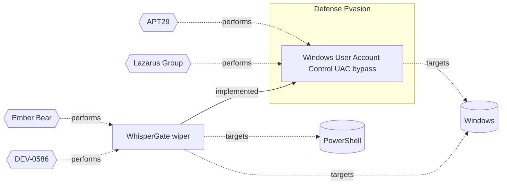

# ☣️ WhisperGate wiper

🔥 **Criticality:High** ⚠️ : A High priority incident is likely to result in a demonstrable impact to public health or safety, national security, economic security, foreign relations, civil liberties, or public confidence. 

🚦 **TLP:CLEAR** ⚪ : Recipients can spread this to the world, there is no limit on disclosure.

🗡️ **ATT&CK Techniques** [T1485 : Data Destruction](https://attack.mitre.org/techniques/T1485 'Adversaries may destroy data and files on specific systems or in large numbers on a network to interrupt availability to systems, services, and networ'), [T1561.001 : Disk Wipe: Disk Content Wipe](https://attack.mitre.org/techniques/T1561/001 'Adversaries may erase the contents of storage devices on specific systems or in large numbers in a network to interrupt availability to system and net'), [T1561.002 : Disk Wipe: Disk Structure Wipe](https://attack.mitre.org/techniques/T1561/002 'Adversaries may corrupt or wipe the disk data structures on a hard drive necessary to boot a system; targeting specific critical systems or in large n'), [T1562.001 : Impair Defenses: Disable or Modify Tools](https://attack.mitre.org/techniques/T1562/001 'Adversaries may modify andor disable security tools to avoid possible detection of their malwaretools and activities This may take many forms, such as'), [T1036 : Masquerading](https://attack.mitre.org/techniques/T1036 'Adversaries may attempt to manipulate features of their artifacts to make them appear legitimate or benign to users andor security tools Masquerading '), [T1134.002 : Access Token Manipulation: Create Process with Token](https://attack.mitre.org/techniques/T1134/002 'Adversaries may create a new process with an existing token to escalate privileges and bypass access controls Processes can be created with the token ')

---

`🔑 UUID : 68ab86f6-378d-4371-ad01-6209fb95d57d` **|** `🏷️ Version : 1` **|** `🗓️ Creation Date : 2024-09-11` **|** `🗓️ Last Modification : 2024-09-11` **|** `Sharing Organisation : {'uuid': '56b0a0f0-b0bc-47d9-bb46-02f80ae2065a', 'name': 'EC DIGIT CSOC'}` **|** `🧱 Schema Identifier : tvm::2.0`

## 👁️ Description

> WisperGate is a multi-stage malicious wiper disguised as ransomware,
> firstly considered as ransomware but later investigations and analysis
> show that it's not only disabling the work of the impacted device
> but deletes/corrupts the whole hard drive and destroys the data stored
> on it by wiping the master boot record. ref [1]
> 
> This is very impactful and severe type of a malware because the system
> needs the MBR (the Master Boot Record) to start the operation system
> during the boot.   
> 
> For the first time this type of a wiper was observed in the beginning
> of the conflict between Russia and Ukraine in Feb 2022. Later the
> reports published new activities of WisperGate as part of a more
> broader campaign that aimed to coordinate destructive cyberattacks
> against critical infrastructure and other targets in a combination
> with kinetic military operations (active physical operations on
> place).
> 
> The GRU's WhisperGate campaign targets government and military
> institutions and the goal is to achieve as much as possible
> disruption of the systems and a total lost of any stored
> information on them.   
> 
> Different research investigations showed that initally it was
> likely that stolen credentials provided the access point for
> the deployment of the wiper. Other known for this wiper at this
> moment is that it contains two types of wipers.   
> 
> 1. The first wiper attempts to destroy the master boot record (MBR) and
> to eradicate any recovery options. Similar to the notorious NotPetya wiper
> that masqueraded as ransomware, WhisperGate is not intended to be an actual
> ransom attempt, since the MBR is completely overwritten. ref [2]      
> 
> 2. In the second stage, a downloader pulls the code required for
> the third step. After a base64-encoded PowerShell command is executed
> twice and an endpoint is requested to enter sleep mode for 20 seconds.
> A Discord server URL, hardcoded into the downloader, is then pinged
> to grab a .DLL file. ref [2]  
> 
> In the further stage of the attack process DLL loader is trying
> to gain administrative privileges. For example, it will attempt
> to escalate itself by trigger User Account Control (UAC) dialog box.
> Once granted Administrator privileges it drops VBScript from a Temp
> directory. The script adds the targeted logical drive to the Windows
> Defenders list of exclusions, using PowerShell commands ref [5].    
> 
> The script contains encoded assembly parts. For decoding of this function,
> a threat actor uses obfuscation Eazfuscator tool. It can use a combination
> of RC4 and XOR loop to decode the content off the base64 string.  
> 
> The script uses another PowerShell commands further to stop the function
> of Windows Defender and uses a second command with "rmdir" to recursively
> delete all Windows Defender files.
> 
> The threat actors developed WhisperGate implemented their own cryptographic
> functions that are built on top of standard and proven libraries. They
> attempted to wipe files in a strange and seemingly slap-dash manner,
> which may or may not have been intentional. ref [5]  
> 
> In Ukraine, a pro-Russian group was detected to conduct destructive attacks
> such as the WhisperGate wiper attacks against ICS targets.  
> 

## 🖥️ Terrain 

 > A threat actor needs an initial entry point to the system,
> for example can use stolen credentials to gain access. 
> 

---

## 🕸️ Relations

### 🐲 Actors sightings 

| Actor                   | Description                                                                                                                                                                                                                                                                                                                                                                                                                                                                                                                                                                                                                                                                                                                                                                                                                                                                                                                                                                                                                                                                                                                                                                                                                                                                                                                                                           | Aliases                                                                 | Source                     | Sighting               | Reference                |
|:------------------------|:----------------------------------------------------------------------------------------------------------------------------------------------------------------------------------------------------------------------------------------------------------------------------------------------------------------------------------------------------------------------------------------------------------------------------------------------------------------------------------------------------------------------------------------------------------------------------------------------------------------------------------------------------------------------------------------------------------------------------------------------------------------------------------------------------------------------------------------------------------------------------------------------------------------------------------------------------------------------------------------------------------------------------------------------------------------------------------------------------------------------------------------------------------------------------------------------------------------------------------------------------------------------------------------------------------------------------------------------------------------------|:------------------------------------------------------------------------|:---------------------------|:-----------------------|:-------------------------|
| [Enterprise] Ember Bear | [Ember Bear](https://attack.mitre.org/groups/G1003) is a Russian state-sponsored cyber espionage group that has been active since at least 2020, linked to Russia's General Staff Main Intelligence Directorate (GRU) 161st Specialist Training Center (Unit 29155).(Citation: CISA GRU29155 2024) [Ember Bear](https://attack.mitre.org/groups/G1003) has primarily focused operations against Ukrainian government and telecommunication entities, but has also operated against critical infrastructure entities in Europe and the Americas.(Citation: Cadet Blizzard emerges as novel threat actor) [Ember Bear](https://attack.mitre.org/groups/G1003) conducted the [WhisperGate](https://attack.mitre.org/software/S0689) destructive wiper attacks against Ukraine in early 2022.(Citation: CrowdStrike Ember Bear Profile March 2022)(Citation: Mandiant UNC2589 March 2022)(Citation: CISA GRU29155 2024) There is some confusion as to whether [Ember Bear](https://attack.mitre.org/groups/G1003) overlaps with another Russian-linked entity referred to as [Saint Bear](https://attack.mitre.org/groups/G1031). At present available evidence strongly suggests these are distinct activities with different behavioral profiles.(Citation: Cadet Blizzard emerges as novel threat actor)(Citation: Palo Alto Unit 42 OutSteel SaintBot February 2022 ) | Bleeding Bear, Cadet Blizzard, DEV-0586, Frozenvista, UAC-0056, UNC2589 | 🗡️ MITRE ATT&CK Groups     | No documented sighting | No documented references |
| DEV-0586                | MSTIC has not found any notable associations between this observed activity, tracked as DEV-0586, and other known activity groups. MSTIC assesses that the malware (WhisperGate), which is designed to look like ransomware but lacking a ransom recovery mechanism, is intended to be destructive and designed to render targeted devices inoperable rather than to obtain a ransom.                                                                                                                                                                                                                                                                                                                                                                                                                                                                                                                                                                                                                                                                                                                                                                                                                                                                                                                                                                                 | Ruinous Ursa, Cadet Blizzard                                            | 🌌 MISP Threat Actor Galaxy | No documented sighting | No documented references |

### 🌊 OpenTide Objects
🚫 No related OpenTide objects indexed.

 --- 

### ⛓️ Threat Chaining

Expand chaining data

| ☣️ Vector                                                                                                                                                                                                                                                                                | ⛓️ Link                  | 🎯 Target                                                                                                                                                                                                                         | ⛰️ Terrain                                                                                                        | 🗡️ ATT&CK                                                                                                                                                                                                                                                                                                                                                                                                                                                                                                                                                                                                                                                                                                                                                                                                                                                                                                                                                                                                                                                                                                                                                                                                                                                                                                    |
|:-----------------------------------------------------------------------------------------------------------------------------------------------------------------------------------------------------------------------------------------------------------------------------------------|:-------------------------|:---------------------------------------------------------------------------------------------------------------------------------------------------------------------------------------------------------------------------------|:------------------------------------------------------------------------------------------------------------------|:-------------------------------------------------------------------------------------------------------------------------------------------------------------------------------------------------------------------------------------------------------------------------------------------------------------------------------------------------------------------------------------------------------------------------------------------------------------------------------------------------------------------------------------------------------------------------------------------------------------------------------------------------------------------------------------------------------------------------------------------------------------------------------------------------------------------------------------------------------------------------------------------------------------------------------------------------------------------------------------------------------------------------------------------------------------------------------------------------------------------------------------------------------------------------------------------------------------------------------------------------------------------------------------------------------------|
| [Windows User Account Control (UAC) bypass](../Threat%20Vectors/☣️%20Windows%20User%20Account%20Control%20(UAC)%20bypass.md 'User Account Control UAC is a security feature implemented in the Windows operating system to prevent potentially harmful programs from making changes...') | `atomicity::implemented` | [WhisperGate wiper](../Threat%20Vectors/☣️%20WhisperGate%20wiper.md 'WisperGate is a multi-stage malicious wiper disguised as ransomware,firstly considered as ransomware but later investigations and analysisshow that it...') | A threat actor needs an initial entry point to the system, for example can use stolen credentials to gain access. | [T1485](https://attack.mitre.org/techniques/T1485 'Adversaries may destroy data and files on specific systems or in large numbers on a network to interrupt availability to systems, services, and networ'), [T1561.001](https://attack.mitre.org/techniques/T1561/001 'Adversaries may erase the contents of storage devices on specific systems or in large numbers in a network to interrupt availability to system and net'), [T1561.002](https://attack.mitre.org/techniques/T1561/002 'Adversaries may corrupt or wipe the disk data structures on a hard drive necessary to boot a system; targeting specific critical systems or in large n'), [T1562.001](https://attack.mitre.org/techniques/T1562/001 'Adversaries may modify andor disable security tools to avoid possible detection of their malwaretools and activities This may take many forms, such as'), [T1036](https://attack.mitre.org/techniques/T1036 'Adversaries may attempt to manipulate features of their artifacts to make them appear legitimate or benign to users andor security tools Masquerading '), [T1134.002](https://attack.mitre.org/techniques/T1134/002 'Adversaries may create a new process with an existing token to escalate privileges and bypass access controls Processes can be created with the token ') |

&nbsp; 

---

## Model Data

#### **🛰️ Domains**

 > Infrastructure technologies domain of interest to attackers.

  - `🏢 Enterprise` : Generic databases, applications, machines and systems that are usually on premises or on Cloud traditional VMs.
 - `🏭 Industrial` : Related to Industrial Control Systems, Operational Technologies their specific concepts (SCADA, PLCs, DCS etc.)

---

#### **🎯 Targets**

 > Granular delimited technical entities holding a value to the organization, that are targeted by adversaries. They might be also involved in the detection coverage as the target of log collection. Partially inspired by Veris.

  - [`💿 Disk drive`](http://veriscommunity.net/enums.html#section-asset) : Media - Hard disk drive
 - [`🖥️ Workstations`](http://veriscommunity.net/enums.html#section-asset) : Placeholder
 - [`🗃️ Critical Documents`](http://veriscommunity.net/enums.html#section-asset) : Placeholder
 - [`👤 Customer`](http://veriscommunity.net/enums.html#section-asset) : People - Customer
 - [`👤 End-user`](http://veriscommunity.net/enums.html#section-asset) : People - End-user
 - [`🗄️ Data Historian`](https://collaborate.mitre.org/attackics/index.php/Engineering_Workstation) : A centralized database located on a computer installed in the control system DMZ supporting external corporate user data access for archival and analysis using statistical process control and other techniques.
 - [`🖥️ Desktop`](http://veriscommunity.net/enums.html#section-asset) : User Device - Desktop or workstation
 - [`🖲️ Control Server`](https://collaborate.mitre.org/attackics/index.php/Control_Server) : A device which acts as both a server and controller, that hosts the control software used in communicating with lower-level control devices in an ICS network (e.g. Remote Terminal Units (RTUs) and Programmable Logic Controllers (PLCs)).
 - [`💻 Laptop`](http://veriscommunity.net/enums.html#section-asset) : User Device - Laptop
 - [`🪪 Personal Information`](http://veriscommunity.net/enums.html#section-asset) : Placeholder

---

#### **💿 Platforms concerned**

 > Actual technologies used by the organization that will be exploited by adversaries during a successful attack, and eventually of relevance for detection. Are named by commercial designation.

  - ` Windows` : Placeholder
 - ` PowerShell` : Placeholder

---

#### **💣 Severity**

 > The severity summarizes the overall danger of incident the vector will provoke, and is to be derived (WIP) from impact, leverage, and difficulty to execute.

 [`⚠️ Significant incident`](https://www.ncsc.gov.uk/news/new-cyber-attack-categorisation-system-improve-uk-response-incidents) : A cyber attack which has a serious impact on a large organisation or on wider / local government, or which poses a considerable risk to central government or (inter)national essential services.

---

#### **🪄 Leverage acquisition**

 > Technical aftermath of the attack from the target perspective, differentiated from impact as it does not consider the value of the consequence, only what increased control the vector execution provides to the adversary.

  - [`⛔ Denial of Service`](https://owasp.org/www-community/Threat_Modeling_Process#stride) : Threat action attempting to deny access to valid users, such as by making a web server temporarily unavailable or unusable.
 - [`💀 Infrastructure Compromise`](https://owasp.org/www-community/Threat_Modeling_Process#stride) : The compromised target is likely to be used to further expand the sphere of influence of the attacker and allow more potent vectors to be executed.

---

#### **💥 Impact**

 > Analysis of the threat vector from the organizational perspective, in non technical term. This aims at putting a clear denomination on what the attacker will actually be able to act upon if the threat vector is realized.

  - [`🛑 Business disruption`](http://veriscommunity.net/enums.html#section-impact) : Business disruption
 - [`☄️ Catastrophic Loss`](http://veriscommunity.net/enums.html#section-impact) : The organization will lose a major part of its capacity to fulfill its strategic objective, and may not be able to recover fully or at all.
 - [`🎖️ National Security`](http://veriscommunity.net/enums.html#section-impact) : The vector execution will expose or destroy such sufficient critical information infrastructure that the country will have to intervene due to loss to key national  or international functions.
 - [`💲 Operating costs`](http://veriscommunity.net/enums.html#section-impact) : Increased operating costs
 - [`🌍 Reputational Damages`](http://veriscommunity.net/enums.html#section-impact) : Damages to the organization public view may be achieved by using directly the access gained, or indirectly with data gathered.

---

#### **🎲 Vector Viability**

 > Described with estimative language (likelyhood probability), describes how likely the analyst believes the vector to actually be realized on the organization infrastructure. Estimative language describes quality and credibility of underlying sources, data, and methodologies based Intelligence Community Directive 203 (ICD 203) and JP 2-0, Joint Intelligence.

 [`🧐 Likely`](https://www.dni.gov/files/documents/ICD/ICD%20203%20Analytic%20Standards.pdf) : Probable (probably) - 55-80%

---

### 🔗 References

**🕊️ Publicly available resources**

- [_1_] https://arstechnica.com/security/2024/09/us-charges-russian-military-officers-for-unleashing-wiper-malware-on-ukraine/
- [_2_] https://www.zdnet.com/article/researchers-break-down-whispergate-wiper-malware-used-in-ukraine-website-defacement/
- [_3_] https://www.crowdstrike.com/blog/technical-analysis-of-whispergate-malware/
- [_4_] https://www.cisa.gov/news-events/cybersecurity-advisories/aa22-057a
- [_5_] https://blogs.blackberry.com/en/2022/02/threat-spotlight-whispergate-wiper-wreaks-havoc-in-ukraine

[1]: https://arstechnica.com/security/2024/09/us-charges-russian-military-officers-for-unleashing-wiper-malware-on-ukraine/
[2]: https://www.zdnet.com/article/researchers-break-down-whispergate-wiper-malware-used-in-ukraine-website-defacement/
[3]: https://www.crowdstrike.com/blog/technical-analysis-of-whispergate-malware/
[4]: https://www.cisa.gov/news-events/cybersecurity-advisories/aa22-057a
[5]: https://blogs.blackberry.com/en/2022/02/threat-spotlight-whispergate-wiper-wreaks-havoc-in-ukraine

---

#### 🏷️ Tags

#-, #-, #-, #
, #
, ##, ##, ##, ##, # , #🏷, #️, # , #T, #a, #g, #s, #
, #

