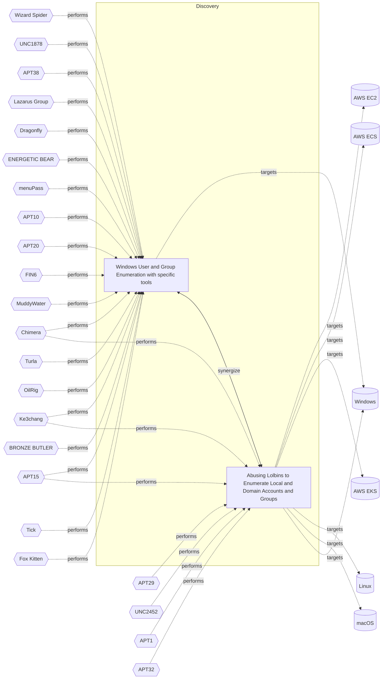

# ☣️ Windows User and Group Enumeration with specific tools

🔥 **Criticality:High** ⚠️ : A High priority incident is likely to result in a demonstrable impact to public health or safety, national security, economic security, foreign relations, civil liberties, or public confidence. 

🚦 **TLP:CLEAR** ⚪ : Recipients can spread this to the world, there is no limit on disclosure.

🗡️ **ATT&CK Techniques** [T1087.002 : Account Discovery: Domain Account](https://attack.mitre.org/techniques/T1087/002 'Adversaries may attempt to get a listing of domain accounts This information can help adversaries determine which domain accounts exist to aid in foll')

---

`🔑 UUID : fe243f7f-ffc5-49c0-94e6-293ae2411ad6` **|** `🏷️ Version : 1` **|** `🗓️ Creation Date : 2024-01-29` **|** `🗓️ Last Modification : 2024-02-06` **|** `Sharing Organisation : {'uuid': '56b0a0f0-b0bc-47d9-bb46-02f80ae2065a', 'name': 'EC DIGIT CSOC'}` **|** `🧱 Schema Identifier : tvm::2.0`

## 👁️ Description

> Adversaries may attempt to enumerate the environment and list all local system 
> and domain accounts or groups.To achieve this purpose, they can use variety of 
> tools and techniques. Their goal is reconnaissance, gathering of user's account 
> information on the system or in the domain and further usage of accounts with higher 
> privilege access.
> 
> There are several tools that can be used by adversaries, such as the following:
>   
> - Kali Tool like enum4linux 
> - Bloodhound can also 
> - smbmap, smbclient, etc..
> - nmap
> - Use of any developped tools or scripts like this one: - windapsearch
> 
> Some cases in which adversaries have used such tools include the following:
> 
> ## Wizard Spider using Bloodhound after Ryuk ransomware compromise:
> 
> Ryuk actors quickly map the network to understand the infection scope. They use native 
> tools like net view, net computers, and ping to locate network shares and domain controllers. 
> For lateral movement, they rely on PowerShell, WMI, Remote Management, RDP, and third-party 
> tool Bloodhound.
> 

## 🖥️ Terrain 

 > Adversaries can take advantage of already compromised system (Windows or 
> Linux OS or OSX) to run commands.
> 

---

## 🕸️ Relations

### 🐲 Actors sightings 

| Actor                      | Description                                                                                                                                                                                                                                                                                                                                                                                                                                                                                                                                                                                                                                                                                                                                                                                                                                                                                                                                                                                                                                                                                                                                                                                                                                                                                                                                                                                                                                                                                                                                                                                                                                                                                                                                                                 | Aliases                                                                                                                                                                                                                                                                                                                                                                                                                                                                                                                                                | Source                     | Sighting               | Reference                |
|:---------------------------|:----------------------------------------------------------------------------------------------------------------------------------------------------------------------------------------------------------------------------------------------------------------------------------------------------------------------------------------------------------------------------------------------------------------------------------------------------------------------------------------------------------------------------------------------------------------------------------------------------------------------------------------------------------------------------------------------------------------------------------------------------------------------------------------------------------------------------------------------------------------------------------------------------------------------------------------------------------------------------------------------------------------------------------------------------------------------------------------------------------------------------------------------------------------------------------------------------------------------------------------------------------------------------------------------------------------------------------------------------------------------------------------------------------------------------------------------------------------------------------------------------------------------------------------------------------------------------------------------------------------------------------------------------------------------------------------------------------------------------------------------------------------------------|:-------------------------------------------------------------------------------------------------------------------------------------------------------------------------------------------------------------------------------------------------------------------------------------------------------------------------------------------------------------------------------------------------------------------------------------------------------------------------------------------------------------------------------------------------------|:---------------------------|:-----------------------|:-------------------------|
| [ICS] Wizard Spider        | [Wizard Spider](https://attack.mitre.org/groups/G0102) is a Russia-based financially motivated threat group originally known for the creation and deployment of [TrickBot](https://attack.mitre.org/software/S0266) since at least 2016. [Wizard Spider](https://attack.mitre.org/groups/G0102) possesses a diverse arsenal of tools and has conducted ransomware campaigns against a variety of organizations, ranging from major corporations to hospitals.(Citation: CrowdStrike Ryuk January 2019)(Citation: DHS/CISA Ransomware Targeting Healthcare October 2020)(Citation: CrowdStrike Wizard Spider October 2020)                                                                                                                                                                                                                                                                                                                                                                                                                                                                                                                                                                                                                                                                                                                                                                                                                                                                                                                                                                                                                                                                                                                                                   | DEV-0193, FIN12, GOLD BLACKBURN, Grim Spider, ITG23, Periwinkle Tempest, TEMP.MixMaster, UNC1878                                                                                                                                                                                                                                                                                                                                                                                                                                                       | 🗡️ MITRE ATT&CK Groups     | No documented sighting | No documented references |
| UNC1878                    | UNC1878 is a financially motivated threat actor that monetizes network access via the deployment of RYUK ransomware. Earlier this year, Mandiant published a blog on a fast-moving adversary deploying RYUK ransomware, UNC1878. Shortly after its release, there was a significant decrease in observed UNC1878 intrusions and RYUK activity overall almost completely vanishing over the summer. But beginning in early fall, Mandiant has seen a resurgence of RYUK along with TTP overlaps indicating that UNC1878 has returned from the grave and resumed their operations.                                                                                                                                                                                                                                                                                                                                                                                                                                                                                                                                                                                                                                                                                                                                                                                                                                                                                                                                                                                                                                                                                                                                                                                            |                                                                                                                                                                                                                                                                                                                                                                                                                                                                                                                                                        | 🌌 MISP Threat Actor Galaxy | No documented sighting | No documented references |
| [ICS] APT38                | [APT38](https://attack.mitre.org/groups/G0082) is a North Korean state-sponsored threat group that specializes in financial cyber operations; it has been attributed to the Reconnaissance General Bureau.(Citation: CISA AA20-239A BeagleBoyz August 2020) Active since at least 2014, [APT38](https://attack.mitre.org/groups/G0082) has targeted banks, financial institutions, casinos, cryptocurrency exchanges, SWIFT system endpoints, and ATMs in at least 38 countries worldwide. Significant operations include the 2016 Bank of Bangladesh heist, during which [APT38](https://attack.mitre.org/groups/G0082) stole $81 million, as well as attacks against Bancomext (Citation: FireEye APT38 Oct 2018) and Banco de Chile (Citation: FireEye APT38 Oct 2018); some of their attacks have been destructive.(Citation: CISA AA20-239A BeagleBoyz August 2020)(Citation: FireEye APT38 Oct 2018)(Citation: DOJ North Korea Indictment Feb 2021)(Citation: Kaspersky Lazarus Under The Hood Blog 2017)North Korean group definitions are known to have significant overlap, and some security researchers report all North Korean state-sponsored cyber activity under the name [Lazarus Group](https://attack.mitre.org/groups/G0032) instead of tracking clusters or subgroups.                                                                                                                                                                                                                                                                                                                                                                                                                                                                                  | BeagleBoyz, Bluenoroff, COPERNICIUM, NICKEL GLADSTONE, Sapphire Sleet, Stardust Chollima                                                                                                                                                                                                                                                                                                                                                                                                                                                               | 🗡️ MITRE ATT&CK Groups     | No documented sighting | No documented references |
| Lazarus Group              | Since 2009, HIDDEN COBRA actors have leveraged their capabilities to target and compromise a range of victims; some intrusions have resulted in the exfiltration of data while others have been disruptive in nature. Commercial reporting has referred to this activity as Lazarus Group and Guardians of Peace. Tools and capabilities used by HIDDEN COBRA actors include DDoS botnets, keyloggers, remote access tools (RATs), and wiper malware. Variants of malware and tools used by HIDDEN COBRA actors include Destover, Duuzer, and Hangman.                                                                                                                                                                                                                                                                                                                                                                                                                                                                                                                                                                                                                                                                                                                                                                                                                                                                                                                                                                                                                                                                                                                                                                                                                      | Operation DarkSeoul, Dark Seoul, Hidden Cobra, Hastati Group, Andariel, Unit 121, Bureau 121, NewRomanic Cyber Army Team, Bluenoroff, Subgroup: Bluenoroff, Group 77, Labyrinth Chollima, Operation Troy, Operation GhostSecret, Operation AppleJeus, APT38, APT 38, Stardust Chollima, Whois Hacking Team, Zinc, Appleworm, Nickel Academy, APT-C-26, NICKEL GLADSTONE, COVELLITE, ATK3, G0032, ATK117, G0082, Citrine Sleet, DEV-0139, DEV-1222, Diamond Sleet, ZINC, Sapphire Sleet, COPERNICIUM, TA404, Lazarus group, BeagleBoyz, Moonstone Sleet | 🌌 MISP Threat Actor Galaxy | No documented sighting | No documented references |
| [ICS] Dragonfly            | [Dragonfly](https://attack.mitre.org/groups/G0035) is a cyber espionage group that has been attributed to Russia's Federal Security Service (FSB) Center 16.(Citation: DOJ Russia Targeting Critical Infrastructure March 2022)(Citation: UK GOV FSB Factsheet April 2022) Active since at least 2010, [Dragonfly](https://attack.mitre.org/groups/G0035) has targeted defense and aviation companies, government entities, companies related to industrial control systems, and critical infrastructure sectors worldwide through supply chain, spearphishing, and drive-by compromise attacks.(Citation: Symantec Dragonfly)(Citation: Secureworks IRON LIBERTY July 2019)(Citation: Symantec Dragonfly Sept 2017)(Citation: Fortune Dragonfly 2.0 Sept 2017)(Citation: Gigamon Berserk Bear October 2021)(Citation: CISA AA20-296A Berserk Bear December 2020)(Citation: Symantec Dragonfly 2.0 October 2017)                                                                                                                                                                                                                                                                                                                                                                                                                                                                                                                                                                                                                                                                                                                                                                                                                                                            | BROMINE, Berserk Bear, Crouching Yeti, DYMALLOY, Energetic Bear, Ghost Blizzard, IRON LIBERTY, TEMP.Isotope, TG-4192                                                                                                                                                                                                                                                                                                                                                                                                                                   | 🗡️ MITRE ATT&CK Groups     | No documented sighting | No documented references |
| ENERGETIC BEAR             | A Russian group that collects intelligence on the energy industry.                                                                                                                                                                                                                                                                                                                                                                                                                                                                                                                                                                                                                                                                                                                                                                                                                                                                                                                                                                                                                                                                                                                                                                                                                                                                                                                                                                                                                                                                                                                                                                                                                                                                                                          | BERSERK BEAR, ALLANITE, CASTLE, DYMALLOY, TG-4192, Dragonfly, Crouching Yeti, Group 24, Havex, Koala Team, IRON LIBERTY, G0035, ATK6, ITG15, BROMINE, Blue Kraken, Ghost Blizzard                                                                                                                                                                                                                                                                                                                                                                      | 🌌 MISP Threat Actor Galaxy | No documented sighting | No documented references |
| [Enterprise] menuPass      | [menuPass](https://attack.mitre.org/groups/G0045) is a threat group that has been active since at least 2006. Individual members of [menuPass](https://attack.mitre.org/groups/G0045) are known to have acted in association with the Chinese Ministry of State Security's (MSS) Tianjin State Security Bureau and worked for the Huaying Haitai Science and Technology Development Company.(Citation: DOJ APT10 Dec 2018)(Citation: District Court of NY APT10 Indictment December 2018)[menuPass](https://attack.mitre.org/groups/G0045) has targeted healthcare, defense, aerospace, finance, maritime, biotechnology, energy, and government sectors globally, with an emphasis on Japanese organizations. In 2016 and 2017, the group is known to have targeted managed IT service providers (MSPs), manufacturing and mining companies, and a university.(Citation: Palo Alto menuPass Feb 2017)(Citation: Crowdstrike CrowdCast Oct 2013)(Citation: FireEye Poison Ivy)(Citation: PWC Cloud Hopper April 2017)(Citation: FireEye APT10 April 2017)(Citation: DOJ APT10 Dec 2018)(Citation: District Court of NY APT10 Indictment December 2018)                                                                                                                                                                                                                                                                                                                                                                                                                                                                                                                                                                                                                      | APT10, BRONZE RIVERSIDE, CVNX, Cicada, HOGFISH, POTASSIUM, Red Apollo, Stone Panda                                                                                                                                                                                                                                                                                                                                                                                                                                                                     | 🗡️ MITRE ATT&CK Groups     | No documented sighting | No documented references |
| APT10                      | menuPass is a threat group that has been active since at least 2006. Individual members of menuPass are known to have acted in association with the Chinese Ministry of State Security's (MSS) Tianjin State Security Bureau and worked for the Huaying Haitai Science and Technology Development Company.                                                                                                                                                                                                                                                                                                                                                                                                                                                                                                                                                                                                                                                                                                                                                                                                                                                                                                                                                                                                                                                                                                                                                                                                                                                                                                                                                                                                                                                                  | STONE PANDA, Menupass Team, happyyongzi, POTASSIUM, Red Apollo, CVNX, HOGFISH, Cloud Hopper, BRONZE RIVERSIDE, ATK41, G0045, Granite Taurus, TA429, Cicada, Purple Typhoon                                                                                                                                                                                                                                                                                                                                                                             | 🌌 MISP Threat Actor Galaxy | No documented sighting | No documented references |
| [Enterprise] Chimera       | [Chimera](https://attack.mitre.org/groups/G0114) is a suspected China-based threat group that has been active since at least 2018 targeting the semiconductor industry in Taiwan as well as data from the airline industry.(Citation: Cycraft Chimera April 2020)(Citation: NCC Group Chimera January 2021)                                                                                                                                                                                                                                                                                                                                                                                                                                                                                                                                                                                                                                                                                                                                                                                                                                                                                                                                                                                                                                                                                                                                                                                                                                                                                                                                                                                                                                                                 |                                                                                                                                                                                                                                                                                                                                                                                                                                                                                                                                                        | 🗡️ MITRE ATT&CK Groups     | No documented sighting | No documented references |
| APT20                      | We’ve uncovered some new data and likely attribution regarding a series of APT watering hole attacks this past summer. Watering hole attacks are an increasingly popular component of APT campaigns, as many people are more aware of spear phishing and are less likely to open documents or click on links in unsolicited emails. Watering hole attacks offer a much better chance of success because they involve compromising legitimate websites and installing malware intended to compromise website visitors. These are often popular websites frequented by people who work in specific industries or have political sympathies to which the actors want to gain access.In contrast to many other APT campaigns, which tend to rely heavily on spear phishing to gain victims, “th3bug” is known for compromising legitimate websites their intended visitors are likely to frequent. Over the summer they compromised several sites, including a well-known Uyghur website written in that native language.                                                                                                                                                                                                                                                                                                                                                                                                                                                                                                                                                                                                                                                                                                                                                       | VIOLIN PANDA, TH3Bug, Crawling Taurus                                                                                                                                                                                                                                                                                                                                                                                                                                                                                                                  | 🌌 MISP Threat Actor Galaxy | No documented sighting | No documented references |
| [ICS] FIN6                 | [FIN6](https://attack.mitre.org/groups/G0037) is a cyber crime group that has stolen payment card data and sold it for profit on underground marketplaces. This group has aggressively targeted and compromised point of sale (PoS) systems in the hospitality and retail sectors.(Citation: FireEye FIN6 April 2016)(Citation: FireEye FIN6 Apr 2019)                                                                                                                                                                                                                                                                                                                                                                                                                                                                                                                                                                                                                                                                                                                                                                                                                                                                                                                                                                                                                                                                                                                                                                                                                                                                                                                                                                                                                      | Camouflage Tempest, ITG08, Magecart Group 6, Skeleton Spider, TAAL                                                                                                                                                                                                                                                                                                                                                                                                                                                                                     | 🗡️ MITRE ATT&CK Groups     | No documented sighting | No documented references |
| FIN6                       | FIN is a group targeting financial assets including assets able to do financial transaction including PoS.                                                                                                                                                                                                                                                                                                                                                                                                                                                                                                                                                                                                                                                                                                                                                                                                                                                                                                                                                                                                                                                                                                                                                                                                                                                                                                                                                                                                                                                                                                                                                                                                                                                                  | SKELETON SPIDER, ITG08, MageCart Group 6, White Giant, GOLD FRANKLIN, ATK88, G0037, Camouflage Tempest, TA4557, Storm-0538                                                                                                                                                                                                                                                                                                                                                                                                                             | 🌌 MISP Threat Actor Galaxy | No documented sighting | No documented references |
| [Enterprise] Ke3chang      | [Ke3chang](https://attack.mitre.org/groups/G0004) is a threat group attributed to actors operating out of China. [Ke3chang](https://attack.mitre.org/groups/G0004) has targeted oil, government, diplomatic, military, and NGOs in Central and South America, the Caribbean, Europe, and North America since at least 2010.(Citation: Mandiant Operation Ke3chang November 2014)(Citation: NCC Group APT15 Alive and Strong)(Citation: APT15 Intezer June 2018)(Citation: Microsoft NICKEL December 2021)                                                                                                                                                                                                                                                                                                                                                                                                                                                                                                                                                                                                                                                                                                                                                                                                                                                                                                                                                                                                                                                                                                                                                                                                                                                                   | APT15, GREF, Mirage, NICKEL, Nylon Typhoon, Playful Dragon, RoyalAPT, Vixen Panda                                                                                                                                                                                                                                                                                                                                                                                                                                                                      | 🗡️ MITRE ATT&CK Groups     | No documented sighting | No documented references |
| APT15                      | This threat actor uses phishing techniques to compromise the networks of foreign ministries of European countries for espionage purposes.                                                                                                                                                                                                                                                                                                                                                                                                                                                                                                                                                                                                                                                                                                                                                                                                                                                                                                                                                                                                                                                                                                                                                                                                                                                                                                                                                                                                                                                                                                                                                                                                                                   | VIXEN PANDA, Ke3Chang, Playful Dragon, Metushy, Lurid, Social Network Team, Royal APT, BRONZE PALACE, BRONZE DAVENPORT, BRONZE IDLEWOOD, NICKEL, G0004, Red Vulture, Nylon Typhoon, Mirage                                                                                                                                                                                                                                                                                                                                                             | 🌌 MISP Threat Actor Galaxy | No documented sighting | No documented references |
| [Enterprise] MuddyWater    | [MuddyWater](https://attack.mitre.org/groups/G0069) is a cyber espionage group assessed to be a subordinate element within Iran's Ministry of Intelligence and Security (MOIS).(Citation: CYBERCOM Iranian Intel Cyber January 2022) Since at least 2017, [MuddyWater](https://attack.mitre.org/groups/G0069) has targeted a range of government and private organizations across sectors, including telecommunications, local government, defense, and oil and natural gas organizations, in the Middle East, Asia, Africa, Europe, and North America.(Citation: Unit 42 MuddyWater Nov 2017)(Citation: Symantec MuddyWater Dec 2018)(Citation: ClearSky MuddyWater Nov 2018)(Citation: ClearSky MuddyWater June 2019)(Citation: Reaqta MuddyWater November 2017)(Citation: DHS CISA AA22-055A MuddyWater February 2022)(Citation: Talos MuddyWater Jan 2022)                                                                                                                                                                                                                                                                                                                                                                                                                                                                                                                                                                                                                                                                                                                                                                                                                                                                                                              | Earth Vetala, MERCURY, Mango Sandstorm, Seedworm, Static Kitten, TA450, TEMP.Zagros                                                                                                                                                                                                                                                                                                                                                                                                                                                                    | 🗡️ MITRE ATT&CK Groups     | No documented sighting | No documented references |
| MuddyWater                 | The MuddyWater attacks are primarily against Middle Eastern nations. However, we have also observed attacks against surrounding nations and beyond, including targets in India and the USA. MuddyWater attacks are characterized by the use of a slowly evolving PowerShell-based first stage backdoor we call “POWERSTATS”. Despite broad scrutiny and reports on MuddyWater attacks, the activity continues with only incremental changes to the tools and techniques.                                                                                                                                                                                                                                                                                                                                                                                                                                                                                                                                                                                                                                                                                                                                                                                                                                                                                                                                                                                                                                                                                                                                                                                                                                                                                                    | TEMP.Zagros, Static Kitten, Seedworm, MERCURY, COBALT ULSTER, G0069, ATK51, Boggy Serpens, Mango Sandstorm, TA450, Earth Vetala                                                                                                                                                                                                                                                                                                                                                                                                                        | 🌌 MISP Threat Actor Galaxy | No documented sighting | No documented references |
| [Enterprise] Turla         | [Turla](https://attack.mitre.org/groups/G0010) is a cyber espionage threat group that has been attributed to Russia's Federal Security Service (FSB).  They have compromised victims in over 50 countries since at least 2004, spanning a range of industries including government, embassies, military, education, research and pharmaceutical companies. [Turla](https://attack.mitre.org/groups/G0010) is known for conducting watering hole and spearphishing campaigns, and leveraging in-house tools and malware, such as [Uroburos](https://attack.mitre.org/software/S0022).(Citation: Kaspersky Turla)(Citation: ESET Gazer Aug 2017)(Citation: CrowdStrike VENOMOUS BEAR)(Citation: ESET Turla Mosquito Jan 2018)(Citation: Joint Cybersecurity Advisory AA23-129A Snake Malware May 2023)                                                                                                                                                                                                                                                                                                                                                                                                                                                                                                                                                                                                                                                                                                                                                                                                                                                                                                                                                                        | BELUGASTURGEON, Group 88, IRON HUNTER, Krypton, Secret Blizzard, Snake, Venomous Bear, Waterbug, WhiteBear                                                                                                                                                                                                                                                                                                                                                                                                                                             | 🗡️ MITRE ATT&CK Groups     | No documented sighting | No documented references |
| Turla                      | A 2014 Guardian article described Turla as: 'Dubbed the Turla hackers, initial intelligence had indicated western powers were key targets, but it was later determined embassies for Eastern Bloc nations were of more interest. Embassies in Belgium, Ukraine, China, Jordan, Greece, Kazakhstan, Armenia, Poland, and Germany were all attacked, though researchers from Kaspersky Lab and Symantec could not confirm which countries were the true targets. In one case from May 2012, the office of the prime minister of a former Soviet Union member country was infected, leading to 60 further computers being affected, Symantec researchers said. There were some other victims, including the ministry for health of a Western European country, the ministry for education of a Central American country, a state electricity provider in the Middle East and a medical organisation in the US, according to Symantec. It is believed the group was also responsible for a much - documented 2008 attack on the US Central Command. The attackers - who continue to operate - have ostensibly sought to carry out surveillance on targets and pilfer data, though their use of encryption across their networks has made it difficult to ascertain exactly what the hackers took.Kaspersky Lab, however, picked up a number of the attackers searches through their victims emails, which included terms such as Nato and EU energy dialogue Though attribution is difficult to substantiate, Russia has previously been suspected of carrying out the attacks and Symantecs Gavin O’ Gorman told the Guardian a number of the hackers appeared to be using Russian names and language in their notes for their malicious code. Cyrillic was also seen in use.' | Snake, VENOMOUS Bear, Group 88, Waterbug, WRAITH, Uroburos, Pfinet, TAG_0530, KRYPTON, Hippo Team, Pacifier APT, Popeye, SIG23, IRON HUNTER, MAKERSMARK, ATK13, G0010, ITG12, Blue Python, SUMMIT, UNC4210, Secret Blizzard, UAC-0144, UAC-0024, UAC-0003                                                                                                                                                                                                                                                                                              | 🌌 MISP Threat Actor Galaxy | No documented sighting | No documented references |
| [ICS] OilRig               | [OilRig](https://attack.mitre.org/groups/G0049) is a suspected Iranian threat group that has targeted Middle Eastern and international victims since at least 2014. The group has targeted a variety of sectors, including financial, government, energy, chemical, and telecommunications. It appears the group carries out supply chain attacks, leveraging the trust relationship between organizations to attack their primary targets. The group works on behalf of the Iranian government based on infrastructure details that contain references to Iran, use of Iranian infrastructure, and targeting that aligns with nation-state interests.(Citation: FireEye APT34 Dec 2017)(Citation: Palo Alto OilRig April 2017)(Citation: ClearSky OilRig Jan 2017)(Citation: Palo Alto OilRig May 2016)(Citation: Palo Alto OilRig Oct 2016)(Citation: Unit42 OilRig Playbook 2023)(Citation: Unit 42 QUADAGENT July 2018)                                                                                                                                                                                                                                                                                                                                                                                                                                                                                                                                                                                                                                                                                                                                                                                                                                                 | APT34, COBALT GYPSY, Crambus, EUROPIUM, Earth Simnavaz, Evasive Serpens, Hazel Sandstorm, Helix Kitten, IRN2, ITG13, TA452                                                                                                                                                                                                                                                                                                                                                                                                                             | 🗡️ MITRE ATT&CK Groups     | No documented sighting | No documented references |
| OilRig                     | OilRig is an Iranian threat group operating primarily in the Middle East by targeting organizations in this region that are in a variety of different industries; however, this group has occasionally targeted organizations outside of the Middle East as well. It also appears OilRig carries out supply chain attacks, where the threat group leverages the trust relationship between organizations to attack their primary targets.                                                                                                                                                                                                                                                                                                                                                                                                                                                                                                                                                                                                                                                                                                                                                                                                                                                                                                                                                                                                                                                                                                                                                                                                                                                                                                                                   | Twisted Kitten, Cobalt Gypsy, Crambus, Helix Kitten, APT 34, APT34, IRN2, ATK40, G0049, Evasive Serpens, Hazel Sandstorm, EUROPIUM, TA452, Earth Simnavaz                                                                                                                                                                                                                                                                                                                                                                                              | 🌌 MISP Threat Actor Galaxy | No documented sighting | No documented references |
|                            |                                                                                                                                                                                                                                                                                                                                                                                                                                                                                                                                                                                                                                                                                                                                                                                                                                                                                                                                                                                                                                                                                                                                                                                                                                                                                                                                                                                                                                                                                                                                                                                                                                                                                                                                                                             |                                                                                                                                                                                                                                                                                                                                                                                                                                                                                                                                                        |                            |                        |                          |
|                            | OilRig is an active and organized threat group, which is evident based on their systematic targeting of specific organizations that appear to be carefully chosen for strategic purposes. Attacks attributed to this group primarily rely on social engineering to exploit the human rather than software vulnerabilities; however, on occasion this group has used recently patched vulnerabilities in the delivery phase of their attacks. The lack of software vulnerability exploitation does not necessarily suggest a lack of sophistication, as OilRig has shown maturity in other aspects of their operations. Such maturities involve:                                                                                                                                                                                                                                                                                                                                                                                                                                                                                                                                                                                                                                                                                                                                                                                                                                                                                                                                                                                                                                                                                                                             |                                                                                                                                                                                                                                                                                                                                                                                                                                                                                                                                                        |                            |                        |                          |
|                            |                                                                                                                                                                                                                                                                                                                                                                                                                                                                                                                                                                                                                                                                                                                                                                                                                                                                                                                                                                                                                                                                                                                                                                                                                                                                                                                                                                                                                                                                                                                                                                                                                                                                                                                                                                             |                                                                                                                                                                                                                                                                                                                                                                                                                                                                                                                                                        |                            |                        |                          |
|                            | -Organized evasion testing used the during development of their tools.                                                                                                                                                                                                                                                                                                                                                                                                                                                                                                                                                                                                                                                                                                                                                                                                                                                                                                                                                                                                                                                                                                                                                                                                                                                                                                                                                                                                                                                                                                                                                                                                                                                                                                      |                                                                                                                                                                                                                                                                                                                                                                                                                                                                                                                                                        |                            |                        |                          |
|                            | -Use of custom DNS Tunneling protocols for command and control (C2) and data exfiltration.                                                                                                                                                                                                                                                                                                                                                                                                                                                                                                                                                                                                                                                                                                                                                                                                                                                                                                                                                                                                                                                                                                                                                                                                                                                                                                                                                                                                                                                                                                                                                                                                                                                                                  |                                                                                                                                                                                                                                                                                                                                                                                                                                                                                                                                                        |                            |                        |                          |
|                            | -Custom web-shells and backdoors used to persistently access servers.                                                                                                                                                                                                                                                                                                                                                                                                                                                                                                                                                                                                                                                                                                                                                                                                                                                                                                                                                                                                                                                                                                                                                                                                                                                                                                                                                                                                                                                                                                                                                                                                                                                                                                       |                                                                                                                                                                                                                                                                                                                                                                                                                                                                                                                                                        |                            |                        |                          |
|                            |                                                                                                                                                                                                                                                                                                                                                                                                                                                                                                                                                                                                                                                                                                                                                                                                                                                                                                                                                                                                                                                                                                                                                                                                                                                                                                                                                                                                                                                                                                                                                                                                                                                                                                                                                                             |                                                                                                                                                                                                                                                                                                                                                                                                                                                                                                                                                        |                            |                        |                          |
|                            | OilRig relies on stolen account credentials for lateral movement. After OilRig gains access to a system, they use credential dumping tools, such as Mimikatz, to steal credentials to accounts logged into the compromised system. The group uses these credentials to access and to move laterally to other systems on the network. After obtaining credentials from a system, operators in this group prefer to use tools other than their backdoors to access the compromised systems, such as remote desktop and putty. OilRig also uses phishing sites to harvest credentials to individuals at targeted organizations to gain access to internet accessible resources, such as Outlook Web Access.Since at least 2014, an Iranian threat group tracked by FireEye as APT34 has conducted reconnaissance aligned with the strategic interests of Iran. The group conducts operations primarily in the Middle East, targeting financial, government, energy, chemical, telecommunications and other industries. Repeated targeting of Middle Eastern financial, energy and government organizations leads FireEye to assess that those sectors are a primary concern of APT34. The use of infrastructure tied to Iranian operations, timing and alignment with the national interests of Iran also lead FireEye to assess that APT34 acts on behalf of the Iranian government.                                                                                                                                                                                                                                                                                                                                                                                          |                                                                                                                                                                                                                                                                                                                                                                                                                                                                                                                                                        |                            |                        |                          |
| [Enterprise] BRONZE BUTLER | [BRONZE BUTLER](https://attack.mitre.org/groups/G0060) is a cyber espionage group with likely Chinese origins that has been active since at least 2008. The group primarily targets Japanese organizations, particularly those in government, biotechnology, electronics manufacturing, and industrial chemistry.(Citation: Trend Micro Daserf Nov 2017)(Citation: Secureworks BRONZE BUTLER Oct 2017)(Citation: Trend Micro Tick November 2019)                                                                                                                                                                                                                                                                                                                                                                                                                                                                                                                                                                                                                                                                                                                                                                                                                                                                                                                                                                                                                                                                                                                                                                                                                                                                                                                            | REDBALDKNIGHT, Tick                                                                                                                                                                                                                                                                                                                                                                                                                                                                                                                                    | 🗡️ MITRE ATT&CK Groups     | No documented sighting | No documented references |
| Tick                       | Tick is a cyber espionage group with likely Chinese origins that has been active since at least 2008. The group appears to have close ties to the Chinese National University of Defense and Technology, which is possibly linked to the PLA. This threat actor targets organizations in the critical infrastructure, heavy industry, manufacturing, and international relations sectors for espionage purposes.  The attacks appear to be centered on political, media, and engineering sectors. STALKER PANDA has been observed conducting targeted attacks against Japan, Taiwan, Hong Kong, and the United States.                                                                                                                                                                                                                                                                                                                                                                                                                                                                                                                                                                                                                                                                                                                                                                                                                                                                                                                                                                                                                                                                                                                                                      | Nian, BRONZE BUTLER, REDBALDKNIGHT, STALKER PANDA, G0060, Stalker Taurus, PLA Unit 61419, Swirl Typhoon                                                                                                                                                                                                                                                                                                                                                                                                                                                | 🌌 MISP Threat Actor Galaxy | No documented sighting | No documented references |
| [Enterprise] Fox Kitten    | [Fox Kitten](https://attack.mitre.org/groups/G0117) is threat actor with a suspected nexus to the Iranian government that has been active since at least 2017 against entities in the Middle East, North Africa, Europe, Australia, and North America. [Fox Kitten](https://attack.mitre.org/groups/G0117) has targeted multiple industrial verticals including oil and gas, technology, government, defense, healthcare, manufacturing, and engineering.(Citation: ClearkSky Fox Kitten February 2020)(Citation: CrowdStrike PIONEER KITTEN August 2020)(Citation: Dragos PARISITE )(Citation: ClearSky Pay2Kitten December 2020)                                                                                                                                                                                                                                                                                                                                                                                                                                                                                                                                                                                                                                                                                                                                                                                                                                                                                                                                                                                                                                                                                                                                          | Lemon Sandstorm, Parisite, Pioneer Kitten, RUBIDIUM, UNC757                                                                                                                                                                                                                                                                                                                                                                                                                                                                                            | 🗡️ MITRE ATT&CK Groups     | No documented sighting | No documented references |
| Fox Kitten                 | PIONEER KITTEN is an Iran-based adversary that has been active since at least 2017 and has a suspected nexus to the Iranian government. This adversary appears to be primarily focused on gaining and maintaining access to entities possessing sensitive information of likely intelligence interest to the Iranian government. According to DRAGOS, they also targeted ICS-related entities using known VPN vulnerabilities. They are widely known to use open source penetration testing tools for reconnaissance and to establish encrypted communications.                                                                                                                                                                                                                                                                                                                                                                                                                                                                                                                                                                                                                                                                                                                                                                                                                                                                                                                                                                                                                                                                                                                                                                                                             | PIONEER KITTEN, PARISITE, UNC757, Lemon Sandstorm, RUBIDIUM                                                                                                                                                                                                                                                                                                                                                                                                                                                                                            | 🌌 MISP Threat Actor Galaxy | No documented sighting | No documented references |

### 🌊 OpenTide Objects
🚫 No related OpenTide objects indexed.

 --- 

### ⛓️ Threat Chaining

Expand chaining data

| ☣️ Vector                                                                                                                                                                                                                                                                                                              | ⛓️ Link              | 🎯 Target                                                                                                                                                                                                                                                                                                                                         | ⛰️ Terrain                                                                                                  | 🗡️ ATT&CK                                                                                                                                                                                                                                                                                                                                                                                                                                                                                                                                                                                                                                                                                                                                                                                                                                                                                                                                                                                                                                          |
|:-----------------------------------------------------------------------------------------------------------------------------------------------------------------------------------------------------------------------------------------------------------------------------------------------------------------------|:---------------------|:-------------------------------------------------------------------------------------------------------------------------------------------------------------------------------------------------------------------------------------------------------------------------------------------------------------------------------------------------|:------------------------------------------------------------------------------------------------------------|:---------------------------------------------------------------------------------------------------------------------------------------------------------------------------------------------------------------------------------------------------------------------------------------------------------------------------------------------------------------------------------------------------------------------------------------------------------------------------------------------------------------------------------------------------------------------------------------------------------------------------------------------------------------------------------------------------------------------------------------------------------------------------------------------------------------------------------------------------------------------------------------------------------------------------------------------------------------------------------------------------------------------------------------------------|
| [Windows User and Group Enumeration with specific tools](../Threat%20Vectors/☣️%20Windows%20User%20and%20Group%20Enumeration%20with%20specific%20tools.md 'Adversaries may attempt to enumerate the environment and list all local system and domain accounts or groupsTo achieve this purpose, they can use vari...') | `support::synergize` | [Abusing Lolbins to Enumerate Local and Domain Accounts and Groups](../Threat%20Vectors/☣️%20Abusing%20Lolbins%20to%20Enumerate%20Local%20and%20Domain%20Accounts%20and%20Groups.md 'Adversaries may attempt to enumerate the environment and list alllocal system and domain accounts or groups  To achieve this purpose, they can use var...') | Adversaries can take advantage of already compromised system (Windows or  Linux OS or OSX) to run commands. | [T1087.001 : Account Discovery: Local Account](https://attack.mitre.org/techniques/T1087/001 'Adversaries may attempt to get a listing of local system accounts This information can help adversaries determine which local accounts exist on a syst'), [T1087.002 : Account Discovery: Domain Account](https://attack.mitre.org/techniques/T1087/002 'Adversaries may attempt to get a listing of domain accounts This information can help adversaries determine which domain accounts exist to aid in foll'), [T1069.001 : Permission Groups Discovery: Local Groups](https://attack.mitre.org/techniques/T1069/001 'Adversaries may attempt to find local system groups and permission settings The knowledge of local system permission groups can help adversaries deter'), [T1069.002 : Permission Groups Discovery: Domain Groups](https://attack.mitre.org/techniques/T1069/002 'Adversaries may attempt to find domain-level groups and permission settings The knowledge of domain-level permission groups can help adversaries deter') |

&nbsp; 

---

## Model Data

#### **⛓️ Cyber Kill Chain**

 > Cyber attacks are typically phased progressions towards strategic objectives. The Unified Kill Chains provides insight into the tactics that hackers employ to attain these objectives. This provides a solid basis to develop (or realign) defensive strategies to raise cyber resilience.

 [`🧭 Discovery`](https://www.unifiedkillchain.com/assets/The-Unified-Kill-Chain.pdf) : Techniques that allow an attacker to gain knowledge about a system and its network environment.

---

#### **🛰️ Domains**

 > Infrastructure technologies domain of interest to attackers.

  - `🏢 Enterprise` : Generic databases, applications, machines and systems that are usually on premises or on Cloud traditional VMs.
 - `☁️ Private Cloud` : Infrastructure hosted at a third party, but based on custom specification and managed on a platform level.
 - `☁️ Public Cloud` : Infrastructure handled by a commercial cloud provider. Managed mostly on a service level, and connected over the internet.

---

#### **🎯 Targets**

 > Granular delimited technical entities holding a value to the organization, that are targeted by adversaries. They might be also involved in the detection coverage as the target of log collection. Partially inspired by Veris.

 [`📂 Directory`](http://veriscommunity.net/enums.html#section-asset) : Server - Directory (LDAP, AD)

---

#### **💿 Platforms concerned**

 > Actual technologies used by the organization that will be exploited by adversaries during a successful attack, and eventually of relevance for detection. Are named by commercial designation.

 ` Windows` : Placeholder

---

#### **💣 Severity**

 > The severity summarizes the overall danger of incident the vector will provoke, and is to be derived (WIP) from impact, leverage, and difficulty to execute.

 [`🧨 Moderate incident`](https://www.ncsc.gov.uk/news/new-cyber-attack-categorisation-system-improve-uk-response-incidents) : A cyber attack on a small organisation, or which poses a considerable risk to a medium-sized organisation, or preliminary indications of cyber activity against a large organisation or the government.

---

#### **🪄 Leverage acquisition**

 > Technical aftermath of the attack from the target perspective, differentiated from impact as it does not consider the value of the consequence, only what increased control the vector execution provides to the adversary.

 [`👁️‍🗨️ Information Disclosure`](https://owasp.org/www-community/Threat_Modeling_Process#stride) : Threat action intending to read a file that one was not granted access to, or to read data in transit.

---

#### **💥 Impact**

 > Analysis of the threat vector from the organizational perspective, in non technical term. This aims at putting a clear denomination on what the attacker will actually be able to act upon if the threat vector is realized.

 [`🥸 Identity Theft`](http://veriscommunity.net/enums.html#section-impact) : Acquisition of sufficient information and privileges to profess as a given individual, for the purpose of abusing and deceiving human trust relationships.

---

#### **🎲 Vector Viability**

 > Described with estimative language (likelyhood probability), describes how likely the analyst believes the vector to actually be realized on the organization infrastructure. Estimative language describes quality and credibility of underlying sources, data, and methodologies based Intelligence Community Directive 203 (ICD 203) and JP 2-0, Joint Intelligence.

 [`🧐 Likely`](https://www.dni.gov/files/documents/ICD/ICD%20203%20Analytic%20Standards.pdf) : Probable (probably) - 55-80%

---

### 🔗 References

**🕊️ Publicly available resources**

- [_1_] https://book.hacktricks.xyz/windows-hardening/active-directory-methodology
- [_2_] https://github.com/Samsar4/Ethical-Hacking-Labs/blob/master/3-Enumeration/3-Enum4linux-Win-and-Samba-Enumeration.md
- [_3_] https://stridergearhead.medium.com/domain-enumeration-using-bloodhound-f2894d5f0da8
- [_4_] https://book.hacktricks.xyz/windows-hardening/active-directory-methodology/bloodhound
- [_5_] https://github.com/ropnop/windapsearch
- [_6_] https://www.cisa.gov/news-events/cybersecurity-advisories/aa20-302a
- [_7_] https://nmap.org/nsedoc/scripts/smb-enum-users.html

[1]: https://book.hacktricks.xyz/windows-hardening/active-directory-methodology
[2]: https://github.com/Samsar4/Ethical-Hacking-Labs/blob/master/3-Enumeration/3-Enum4linux-Win-and-Samba-Enumeration.md
[3]: https://stridergearhead.medium.com/domain-enumeration-using-bloodhound-f2894d5f0da8
[4]: https://book.hacktricks.xyz/windows-hardening/active-directory-methodology/bloodhound
[5]: https://github.com/ropnop/windapsearch
[6]: https://www.cisa.gov/news-events/cybersecurity-advisories/aa20-302a
[7]: https://nmap.org/nsedoc/scripts/smb-enum-users.html

---

#### 🏷️ Tags

#-, #-, #-, #
, #
, ##, ##, ##, ##, # , #🏷, #️, # , #T, #a, #g, #s, #
, #

