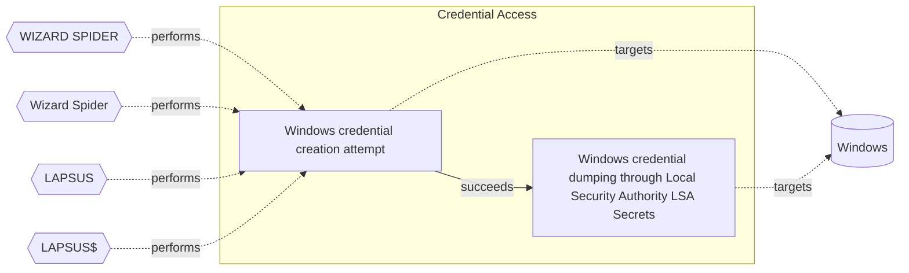

# ☣️ Windows credential creation attempt

🔥 **Criticality:High** ⚠️ : A High priority incident is likely to result in a demonstrable impact to public health or safety, national security, economic security, foreign relations, civil liberties, or public confidence. 

🚦 **TLP:CLEAR** ⚪ : Recipients can spread this to the world, there is no limit on disclosure.

🗡️ **ATT&CK Techniques** [T1078 : Valid Accounts](https://attack.mitre.org/techniques/T1078 'Adversaries may obtain and abuse credentials of existing accounts as a means of gaining Initial Access, Persistence, Privilege Escalation, or Defense '), [T1552.001 : Unsecured Credentials: Credentials In Files](https://attack.mitre.org/techniques/T1552/001 'Adversaries may search local file systems and remote file shares for files containing insecurely stored credentials These can be files created by user'), [T1003 : OS Credential Dumping](https://attack.mitre.org/techniques/T1003 'Adversaries may attempt to dump credentials to obtain account login and credential material, normally in the form of a hash or a clear text password C'), [T1078.003 : Valid Accounts: Local Accounts](https://attack.mitre.org/techniques/T1078/003 'Adversaries may obtain and abuse credentials of a local account as a means of gaining Initial Access, Persistence, Privilege Escalation, or Defense Ev'), [T1136 : Create Account](https://attack.mitre.org/techniques/T1136 'Adversaries may create an account to maintain access to victim systemsCitation Symantec WastedLocker June 2020 With a sufficient level of access, crea'), [T1550.004 : Use Alternate Authentication Material: Web Session Cookie](https://attack.mitre.org/techniques/T1550/004 'Adversaries can use stolen session cookies to authenticate to web applications and services This technique bypasses some multi-factor authentication p')

---

`🔑 UUID : 09b9aee8-3849-4578-8243-17157d6d54e0` **|** `🏷️ Version : 1` **|** `🗓️ Creation Date : 2025-02-10` **|** `🗓️ Last Modification : 2025-02-14` **|** `Sharing Organisation : {'uuid': '56b0a0f0-b0bc-47d9-bb46-02f80ae2065a', 'name': 'EC DIGIT CSOC'}` **|** `🧱 Schema Identifier : tvm::2.1`

## 👁️ Description

> ### Windows Credential Creation Attempt
> A Windows credential creation attempt refers to 
> activities where a user or system processes aim 
> to create, store, or manipulate sets of credentials 
> (e.g., username and password) within a Windows 
> environment. This can involve legitimate system 
> operations or malicious activities by threat actors 
> seeking unauthorized access.
> 
> #### Examples of Windows Credential Creation Attempt
> **User Account Creation:**
> 
> - Using administrative command-line tools such as 
> `net user` to add new user accounts.
> - Leveraging PowerShell scripts or commands to automate 
> the creation of user accounts.
> `New-LocalUser`: Create a new local user account with 
> `New-LocalUser -Name "[username]"` 
> `-Password (ConvertTo-SecureString "[password]"` 
> `-AsPlainText -Force)`.
> 
> **Abuse of Winlogon:**  
> 
> Winlogon.exe is responsible for managing secure user 
> interactions during logon. Threat actors can exploit 
> this process to pass harvested credentials to the 
> Local Security Authority (LSA), thereby impersonating 
> legitimate users.
> 
> **Saved Passwords in Credential Manager:**  
> 
> Threat actors can exploit stored credentials in the 
> Windows Credential Manager. These credentials can be 
> used to automatically log into various services or 
> create new user accounts using the gathered information.
> 
> **Credential Injection:**  
> 
> Using tools or scripts to inject credentials directly 
> into the Windows Security Accounts Manager (SAM) 
> database or LSA to create or modify credentials.
> 
> **Known Tools for Credential Creation and Manipulation**
> 
> - **Windows Credential Editor (WCE):** 
> WCE is a tool capable of listing logon sessions and 
> modifying associated credentials, such as adding or 
> changing NTLM hashes, plaintext passwords, and 
> Kerberos tickets. It can be misused to create unauthorised 
> credentials on a Windows system.
> 

## 🖥️ Terrain 

 > A threat actor needs a valid and privileged accounts 
> or equivalent  
> 

---

## 🕸️ Relations

### 🐲 Actors sightings 

| Actor               | Description                                                                                                                                                                                                                                                                                                                                                                                                                                                                                                                                                                                                                                                                                                                                                                                                                                                                                                                                                                                                                                                                                                                                             | Aliases                                                                                                                                         | Source                     | Sighting                                                                                                                                                                                                                                                       | Reference                                                                                                |
|:--------------------|:--------------------------------------------------------------------------------------------------------------------------------------------------------------------------------------------------------------------------------------------------------------------------------------------------------------------------------------------------------------------------------------------------------------------------------------------------------------------------------------------------------------------------------------------------------------------------------------------------------------------------------------------------------------------------------------------------------------------------------------------------------------------------------------------------------------------------------------------------------------------------------------------------------------------------------------------------------------------------------------------------------------------------------------------------------------------------------------------------------------------------------------------------------|:------------------------------------------------------------------------------------------------------------------------------------------------|:---------------------------|:---------------------------------------------------------------------------------------------------------------------------------------------------------------------------------------------------------------------------------------------------------------|:---------------------------------------------------------------------------------------------------------|
| WIZARD SPIDER       | Wizard Spider is reportedly associated with Grim Spider and Lunar Spider.The WIZARD SPIDER threat group is the Russia-based operator of the TrickBot banking malware. This group represents a growing criminal enterprise of which GRIM SPIDER appears to be a subset. The LUNAR SPIDER threat group is the Eastern European-based operator and developer of the commodity banking malware called BokBot (aka IcedID), which was first observed in April 2017. The BokBot malware provides LUNAR SPIDER affiliates with a variety of capabilities to enable credential theft and wire fraud, through the use of webinjects and a malware distribution function.GRIM SPIDER is a sophisticated eCrime group that has been operating the Ryuk ransomware since August 2018, targeting large organizations for a high-ransom return. This methodology, known as “big game hunting,” signals a shift in operations for WIZARD SPIDER, a criminal enterprise of which GRIM SPIDER appears to be a cell. The WIZARD SPIDER threat group, known as the Russia-based operator of the TrickBot banking malware, had focused primarily on wire fraud in the past. | TEMP.MixMaster, GOLD BLACKBURN, FIN12, Periwinkle Tempest, DEV-0193, Storm-0193, Trickbot LLC, UNC2053, Pistachio Tempest, DEV-0237, Storm-0230 | 🌌 MISP Threat Actor Galaxy | No documented sighting                                                                                                                                                                                                                                         | No documented references                                                                                 |
| [ICS] Wizard Spider | [Wizard Spider](https://attack.mitre.org/groups/G0102) is a Russia-based financially motivated threat group originally known for the creation and deployment of [TrickBot](https://attack.mitre.org/software/S0266) since at least 2016. [Wizard Spider](https://attack.mitre.org/groups/G0102) possesses a diverse arsenal of tools and has conducted ransomware campaigns against a variety of organizations, ranging from major corporations to hospitals.(Citation: CrowdStrike Ryuk January 2019)(Citation: DHS/CISA Ransomware Targeting Healthcare October 2020)(Citation: CrowdStrike Wizard Spider October 2020)                                                                                                                                                                                                                                                                                                                                                                                                                                                                                                                               | DEV-0193, FIN12, GOLD BLACKBURN, Grim Spider, ITG23, Periwinkle Tempest, TEMP.MixMaster, UNC1878                                                | 🗡️ MITRE ATT&CK Groups     | No documented sighting                                                                                                                                                                                                                                         | https://github.com/attackevals/ael/blob/main/Enterprise/wizard_spider/Operations_Flow/Operations_Flow.md |
| LAPSUS              | An actor group conducting large-scale social engineering and extortion campaign against multiple organizations with some seeing evidence of destructive elements.                                                                                                                                                                                                                                                                                                                                                                                                                                                                                                                                                                                                                                                                                                                                                                                                                                                                                                                                                                                       | LAPSUS$, DEV-0537, SLIPPY SPIDER, Strawberry Tempest                                                                                            | 🌌 MISP Threat Actor Galaxy | No documented sighting                                                                                                                                                                                                                                         | No documented references                                                                                 |
| [Mobile] LAPSUS$    | [LAPSUS$](https://attack.mitre.org/groups/G1004) is cyber criminal threat group that has been active since at least mid-2021. [LAPSUS$](https://attack.mitre.org/groups/G1004) specializes in large-scale social engineering and extortion operations, including destructive attacks without the use of ransomware. The group has targeted organizations globally, including in the government, manufacturing, higher education, energy, healthcare, technology, telecommunications, and media sectors.(Citation: BBC LAPSUS Apr 2022)(Citation: MSTIC DEV-0537 Mar 2022)(Citation: UNIT 42 LAPSUS Mar 2022)                                                                                                                                                                                                                                                                                                                                                                                                                                                                                                                                            | DEV-0537, Strawberry Tempest                                                                                                                    | 🗡️ MITRE ATT&CK Groups     | This threat actor group is known and observed to use accessto local password managers and databases to obtain user'scredentials. They use variety of techniques to gathercredentials and other valuable information and afterto trade it on the black markets. | https://www.nccgroup.com/us/research-blog/lapsus-recent-techniques-tactics-and-procedures/               |

### 🌊 OpenTide Objects
🚫 No related OpenTide objects indexed.

 --- 

### ⛓️ Threat Chaining

Expand chaining data

| ☣️ Vector                                                                                                                                                                                                                                                                | ⛓️ Link              | 🎯 Target                                                                                                                                                                                                                                                                                                                                                       | ⛰️ Terrain                                                                                                                                                                                                                   | 🗡️ ATT&CK                                                                                                                                                                                                                                                                                                                                                                                                                                                                                     |
|:-------------------------------------------------------------------------------------------------------------------------------------------------------------------------------------------------------------------------------------------------------------------------|:---------------------|:---------------------------------------------------------------------------------------------------------------------------------------------------------------------------------------------------------------------------------------------------------------------------------------------------------------------------------------------------------------|:-----------------------------------------------------------------------------------------------------------------------------------------------------------------------------------------------------------------------------|:----------------------------------------------------------------------------------------------------------------------------------------------------------------------------------------------------------------------------------------------------------------------------------------------------------------------------------------------------------------------------------------------------------------------------------------------------------------------------------------------|
| [Windows credential creation attempt](../Threat%20Vectors/☣️%20Windows%20credential%20creation%20attempt.md '### Windows Credential Creation AttemptA Windows credential creation attempt refers to activities where a user or system processes aim to create, stor...') | `sequence::succeeds` | [Windows credential dumping through Local Security Authority (LSA) Secrets](../Threat%20Vectors/☣️%20Windows%20credential%20dumping%20through%20Local%20Security%20Authority%20(LSA)%20Secrets.md 'Adversaries may attempt to dump credentials to obtain account loginand credentials details, using techniques for Local Security Authority LSA Secrets ...') | Threat actor is searching entry points in the network to  gain system level access and registry access. This access  can be used for dumping information from LSA database and  further lateral movement in the environment. | [T1003 : OS Credential Dumping](https://attack.mitre.org/techniques/T1003 'Adversaries may attempt to dump credentials to obtain account login and credential material, normally in the form of a hash or a clear text password C'), [T1003.004 : OS Credential Dumping: LSA Secrets](https://attack.mitre.org/techniques/T1003/004 'Adversaries with SYSTEM access to a host may attempt to access Local Security Authority LSA secrets, which can contain a variety of different credenti') |

&nbsp; 

---

## Model Data

#### **⛓️ Cyber Kill Chain**

 > Cyber attacks are typically phased progressions towards strategic objectives. The Unified Kill Chains provides insight into the tactics that hackers employ to attain these objectives. This provides a solid basis to develop (or realign) defensive strategies to raise cyber resilience.

 [`🔑 Credential Access`](https://www.unifiedkillchain.com/assets/The-Unified-Kill-Chain.pdf) : Techniques resulting in the access of, or control over, system, service or domain credentials.

---

#### **🛰️ Domains**

 > Infrastructure technologies domain of interest to attackers.

  - `🏢 Enterprise` : Generic databases, applications, machines and systems that are usually on premises or on Cloud traditional VMs.
 - `☁️ Private Cloud` : Infrastructure hosted at a third party, but based on custom specification and managed on a platform level.
 - `☁️ Public Cloud` : Infrastructure handled by a commercial cloud provider. Managed mostly on a service level, and connected over the internet.

---

#### **🎯 Targets**

 > Granular delimited technical entities holding a value to the organization, that are targeted by adversaries. They might be also involved in the detection coverage as the target of log collection. Partially inspired by Veris.

  - [`🔐 Auth token`](http://veriscommunity.net/enums.html#section-asset) : User Device - Authentication token or device
 - [`👤 Customer`](http://veriscommunity.net/enums.html#section-asset) : People - Customer
 - [`💻 Laptop`](http://veriscommunity.net/enums.html#section-asset) : User Device - Laptop
 - [`🖥️ Web Application Servers`](http://veriscommunity.net/enums.html#section-asset) : Placeholder
 - [`🖥️ Workstations`](http://veriscommunity.net/enums.html#section-asset) : Placeholder
 - [`🕹️ Remote access`](http://veriscommunity.net/enums.html#section-asset) : Server - Remote access

---

#### **💿 Platforms concerned**

 > Actual technologies used by the organization that will be exploited by adversaries during a successful attack, and eventually of relevance for detection. Are named by commercial designation.

 ` Windows` : Placeholder

---

#### **💣 Severity**

 > The severity summarizes the overall danger of incident the vector will provoke, and is to be derived (WIP) from impact, leverage, and difficulty to execute.

 [`⚠️ Significant incident`](https://www.ncsc.gov.uk/news/new-cyber-attack-categorisation-system-improve-uk-response-incidents) : A cyber attack which has a serious impact on a large organisation or on wider / local government, or which poses a considerable risk to central government or (inter)national essential services.

---

#### **🪄 Leverage acquisition**

 > Technical aftermath of the attack from the target perspective, differentiated from impact as it does not consider the value of the consequence, only what increased control the vector execution provides to the adversary.

  - [`🦠 Dwelling`](https://owasp.org/www-community/Threat_Modeling_Process#stride) : Active or passive extended presence in the target, which performs adversarial operations continuously.
 - [`💅 Elevation of privilege`](https://owasp.org/www-community/Threat_Modeling_Process#stride) : Capacity to augment leverage over the target system by upgrading the compromised access rights
 - [`🔐 New Accounts`](https://owasp.org/www-community/Threat_Modeling_Process#stride) : Ability to create new arbitrary user accounts.
 - [`⚙️ Modify configuration`](https://owasp.org/www-community/Threat_Modeling_Process#stride) : Modify configuration or services
 - [`🐒 Tampering`](https://owasp.org/www-community/Threat_Modeling_Process#stride) : Threat action intending to maliciously change or modify persistent data, such as records in a database, and the alteration of data in transit between two computers over an open network, such as the Internet.

---

#### **💥 Impact**

 > Analysis of the threat vector from the organizational perspective, in non technical term. This aims at putting a clear denomination on what the attacker will actually be able to act upon if the threat vector is realized.

  - [`🛑 Business disruption`](http://veriscommunity.net/enums.html#section-impact) : Business disruption
 - [`🥸 Identity Theft`](http://veriscommunity.net/enums.html#section-impact) : Acquisition of sufficient information and privileges to profess as a given individual, for the purpose of abusing and deceiving human trust relationships.
 - [`🩼 Impairement`](http://veriscommunity.net/enums.html#section-impact) : Incapacitation of a particular key system that will cause disruptions in day-to-day operations, and eventually service delivery.
 - [`🤬 Lose Capabilities`](http://veriscommunity.net/enums.html#section-impact) : Vector execution will remove key functions to the organization, which will not be easily circumvented. Most day-to-day is heavily impaired, but processes can reorganize at a loss.
 - [`🌍 Reputational Damages`](http://veriscommunity.net/enums.html#section-impact) : Damages to the organization public view may be achieved by using directly the access gained, or indirectly with data gathered.

---

#### **🎲 Vector Viability**

 > Described with estimative language (likelyhood probability), describes how likely the analyst believes the vector to actually be realized on the organization infrastructure. Estimative language describes quality and credibility of underlying sources, data, and methodologies based Intelligence Community Directive 203 (ICD 203) and JP 2-0, Joint Intelligence.

 [`♻️ Environment dependent`](https://www.dni.gov/files/documents/ICD/ICD%20203%20Analytic%20Standards.pdf) : Depends

---

### 🔗 References

**🕊️ Publicly available resources**

- [_1_] https://learn.microsoft.com/en-us/windows-server/security/windows-authentication/credentials-processes-in-windows-authentication
- [_2_] https://woshub.com/saved-passwords-windows-credential-manager/
- [_3_] https://help.fortinet.com/fsiem/Public_Resource_Access/7_1_0/rules/PH_RULE_Windows_Credential_Editor.htm

[1]: https://learn.microsoft.com/en-us/windows-server/security/windows-authentication/credentials-processes-in-windows-authentication
[2]: https://woshub.com/saved-passwords-windows-credential-manager/
[3]: https://help.fortinet.com/fsiem/Public_Resource_Access/7_1_0/rules/PH_RULE_Windows_Credential_Editor.htm

---

#### 🏷️ Tags

#-, #-, #-, #
, #
, ##, ##, ##, ##, # , #🏷, #️, # , #T, #a, #g, #s, #
, #

