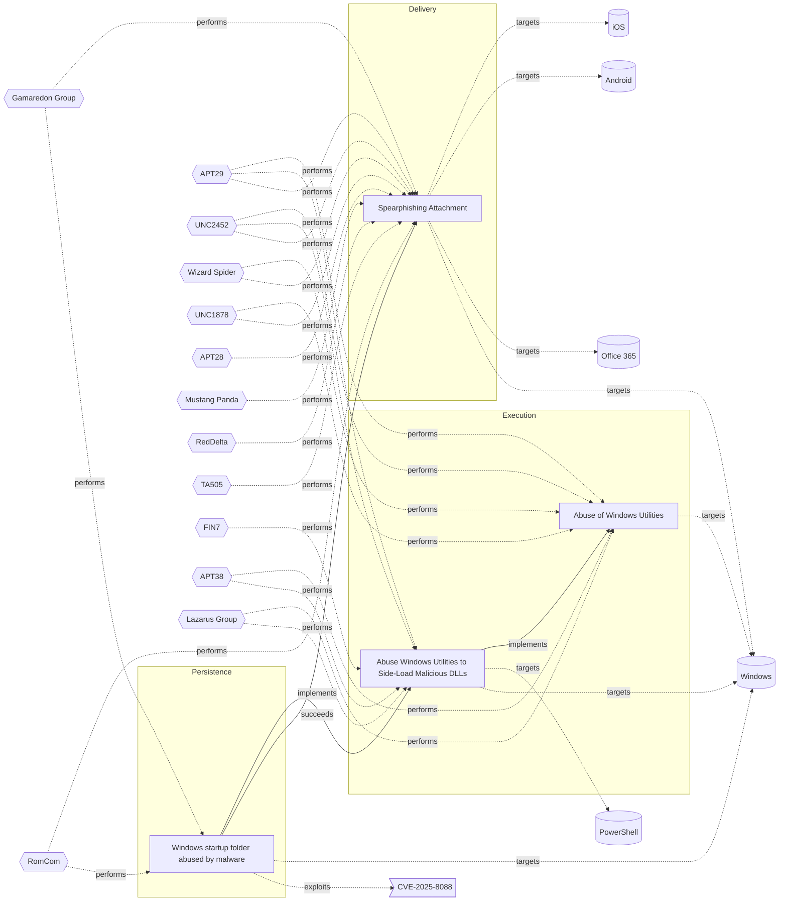

# ☣️ Windows startup folder abused by malware

🔥 **Criticality:High** ⚠️ : A High priority incident is likely to result in a demonstrable impact to public health or safety, national security, economic security, foreign relations, civil liberties, or public confidence. 

🚦 **TLP:CLEAR** ⚪ : Recipients can spread this to the world, there is no limit on disclosure.

🗡️ **ATT&CK Techniques** [T1547.001 : Boot or Logon Autostart Execution: Registry Run Keys / Startup Folder](https://attack.mitre.org/techniques/T1547/001 'Adversaries may achieve persistence by adding a program to a startup folder or referencing it with a Registry run key Adding an entry to the run keys ')

---

`🔑 UUID : cce22952-735a-4255-8319-e5e44aef9d85` **|** `🏷️ Version : 1` **|** `🗓️ Creation Date : 2025-08-21` **|** `🗓️ Last Modification : 2025-08-22` **|** `Sharing Organisation : {'uuid': '56b0a0f0-b0bc-47d9-bb46-02f80ae2065a', 'name': 'EC DIGIT CSOC'}` **|** `🧱 Schema Identifier : tvm::2.1`

## 👁️ Description

> The Windows Startup folder is a legitimate feature in Windows that allows
> users to specify programs or applications to launch automatically when the
> operating system starts. In several reports and analysis different threat
> actors have been known to abuse this feature to achieve persistence and
> evade detection on compromised systems. 
> 
> As a first step the malware is distributed by an initial threat vector, for
> example spear-phishing attack. Once the malware is on the targeted system it
> creates a shortcut or executable file in the Windows Startup folder
> ref [5], [6].
> 
> There are several different possible startup locations which can be used
> by the threat actors to run malicious programs. 
> 
> Examples:
> 
> - `C:\Users\<username>\AppData\Roaming\Microsoft\Windows\Start Menu\Programs\Startup`
> - `C:\ProgramData\Microsoft\Windows\Start Menu\Programs\Startup`.
> - `C:\Users\<username>\AppData\Roaming\Microsoft\Windows\Start Menu\Programs\Startup`
> - `C:\ProgramData\Microsoft\Windows\Start Menu\Programs\Startup`
> 
> A recent campaign, ref [2], showed threat actors exploiting a vulnerability
> in a software application  to deploy shortcut files in the startup folder,
> that would point to the malicious executable.
> 
> When the user logs in or the system boots, Windows automatically executes
> the programs or applications in the Startup folder. Usually the malware is
> disguised as a legitimate program and runs in the background, often without 
> the user's knowledge or consent.
> 
> ### Techniques used by malware
> 
> - Shortcut files: Malware creates a shortcut file (.lnk) in the Startup
>   folder, pointing to the malicious executable.
> - Executable files: Malware places an executable file (.exe) directly in the
>   Startup folder.
> - Registry modifications: Some malware (Amadey) may also overwrite the 
> Windows registry key, thush changing the startup folder to the ones 
> containing its payload.
> - Scripts - some threat actors have used the startup folder as a persistence 
> mechanism to execute script files.
> - Archive exploitation: WinRAR or crafted installers extract payloads into
>   the Startup folder (notably CVE-2023-38831 exploited in the wild).
> 
> ### Known malware families which can abuse a Windows Startup folder
> 
> - Ransomware: Some ransomware variants, like WannaCry and NotPetya, used
>   the Startup folder to launch their malicious payloads.
> - Trojans: Trojans, such as Emotet and TrickBot, have been known to use the
>   Startup folder to maintain persistence on compromised systems.
> - Adware/PUP: Adware or Potentially Unwanted Programs (PUPs), like the 
> notorious Ask Toolbar, has been found to use the Startup folder to launch 
> themselves.  
> - LNK Loaders (e.g Gamaredon) ref [7].
> 

## 🖥️ Terrain 

 > A threat actor needs an initial access to a targeted Windows system.  
> 

 &nbsp;
### ❤️‍🩹 Common Vulnerability Enumeration

⚠️ ERROR : Could not successfully retrieve CVE Details, double check the broken links below to confirm the CVE ID exists.

- [💔 CVE-2025-8088](https://nvd.nist.gov/vuln/detail/CVE-2025-8088)

&nbsp;

---

## 🕸️ Relations

### 🐲 Actors sightings 

| Actor                        | Description                                                                                                                                                                                                                                                                                                                                                                                                                                                                                                                                                                                                                                                                                                                                                                                                                                                                                                       | Aliases                                                                                                                                                  | Source                     | Sighting                                                                                                                                                                                                                                                 | Reference                                                                                                                   |
|:-----------------------------|:------------------------------------------------------------------------------------------------------------------------------------------------------------------------------------------------------------------------------------------------------------------------------------------------------------------------------------------------------------------------------------------------------------------------------------------------------------------------------------------------------------------------------------------------------------------------------------------------------------------------------------------------------------------------------------------------------------------------------------------------------------------------------------------------------------------------------------------------------------------------------------------------------------------|:---------------------------------------------------------------------------------------------------------------------------------------------------------|:---------------------------|:---------------------------------------------------------------------------------------------------------------------------------------------------------------------------------------------------------------------------------------------------------|:----------------------------------------------------------------------------------------------------------------------------|
| RomCom                       | ROMCOM is an evolving and sophisticated threat actor group that has been using the malware tool ROMCOM for espionage and financially motivated attacks. They have targeted organizations in Ukraine and NATO countries, including military personnel, government agencies, and political leaders. The ROMCOM backdoor is capable of stealing sensitive information and deploying other malware, showcasing the group's adaptability and growing sophistication.                                                                                                                                                                                                                                                                                                                                                                                                                                                   | Storm-0978, UAT-5647                                                                                                                                     | 🌌 MISP Threat Actor Galaxy | Russia-linked threat actor RomCom exploited WinRAR a vulnerability as azero-day in spearphishing attacks to deploy various backdoors ref [2].                                                                                                            | https://www.welivesecurity.com/en/eset-research/update-winrar-tools-now-romcom-and-others-exploiting-zero-day-vulnerability |
| Gamaredon Group              | Unit 42 threat researchers have recently observed a threat group distributing new, custom developed malware. We have labelled this threat group the Gamaredon Group and our research shows that the Gamaredon Group has been active since at least 2013.  In the past, the Gamaredon Group has relied heavily on off-the-shelf tools. Our new research shows the Gamaredon Group have made a shift to custom-developed malware. We believe this shift indicates the Gamaredon Group have improved their technical capabilities.                                                                                                                                                                                                                                                                                                                                                                                   | ACTINIUM, DEV-0157, Blue Otso, BlueAlpha, G0047, IRON TILDEN, PRIMITIVE BEAR, Shuckworm, Trident Ursa, UAC-0010, Winterflounder, Aqua Blizzard, Actinium | 🌌 MISP Threat Actor Galaxy | No documented sighting                                                                                                                                                                                                                                   | No documented references                                                                                                    |
| [Enterprise] Gamaredon Group | [Gamaredon Group](https://attack.mitre.org/groups/G0047) is a suspected Russian cyber espionage threat group that has targeted military, NGO, judiciary, law enforcement, and non-profit organizations in Ukraine since at least 2013. The name [Gamaredon Group](https://attack.mitre.org/groups/G0047) comes from a misspelling of the word "Armageddon", which was detected in the adversary's early campaigns.(Citation: Palo Alto Gamaredon Feb 2017)(Citation: TrendMicro Gamaredon April 2020)(Citation: ESET Gamaredon June 2020)(Citation: Symantec Shuckworm January 2022)(Citation: Microsoft Actinium February 2022)In November 2021, the Ukrainian government publicly attributed [Gamaredon Group](https://attack.mitre.org/groups/G0047) to Russia's Federal Security Service (FSB) Center 18.(Citation: Bleepingcomputer Gamardeon FSB November 2021)(Citation: Microsoft Actinium February 2022) | ACTINIUM, Aqua Blizzard, Armageddon, DEV-0157, IRON TILDEN, Primitive Bear, Shuckworm                                                                    | 🗡️ MITRE ATT&CK Groups     | Gamaredon Group is believed to be with Russian origin. They are observedto leveraged both malicious Windows shortcut files and script objectswritten to the Startup folder for persistence.Example: `file_path == "*\\Programs\\Startup\\*.lnk` ref [7]. | https://www.elastic.co/security-labs/playing-defense-against-gamaredon-group                                                |

### 🌊 OpenTide Objects
🚫 No related OpenTide objects indexed.

 --- 

### ⛓️ Threat Chaining

Expand chaining data

| ☣️ Vector                                                                                                                                                                                                                                                                                                      | ⛓️ Link                 | 🎯 Target                                                                                                                                                                                                                                                                                                       | ⛰️ Terrain                                                                                                                                                                                                                                                                                                                                                                                                                                                                                                                                                                                                                                                                                                                                                                                                                                                | 🗡️ ATT&CK                                                                                                                                                                                                                                                                                                                                                                                                                                                                                                                                                                                                                                                                                                                                                                                                                                                                                                                                                                                                                                                                                                                                                                                                                                                                                                                                                                                                                                                                                                         |
|:---------------------------------------------------------------------------------------------------------------------------------------------------------------------------------------------------------------------------------------------------------------------------------------------------------------|:------------------------|:---------------------------------------------------------------------------------------------------------------------------------------------------------------------------------------------------------------------------------------------------------------------------------------------------------------|:----------------------------------------------------------------------------------------------------------------------------------------------------------------------------------------------------------------------------------------------------------------------------------------------------------------------------------------------------------------------------------------------------------------------------------------------------------------------------------------------------------------------------------------------------------------------------------------------------------------------------------------------------------------------------------------------------------------------------------------------------------------------------------------------------------------------------------------------------------|:------------------------------------------------------------------------------------------------------------------------------------------------------------------------------------------------------------------------------------------------------------------------------------------------------------------------------------------------------------------------------------------------------------------------------------------------------------------------------------------------------------------------------------------------------------------------------------------------------------------------------------------------------------------------------------------------------------------------------------------------------------------------------------------------------------------------------------------------------------------------------------------------------------------------------------------------------------------------------------------------------------------------------------------------------------------------------------------------------------------------------------------------------------------------------------------------------------------------------------------------------------------------------------------------------------------------------------------------------------------------------------------------------------------------------------------------------------------------------------------------------------------|
| [Windows startup folder abused by malware](../Threat%20Vectors/☣️%20Windows%20startup%20folder%20abused%20by%20malware.md 'The Windows Startup folder is a legitimate feature in Windows that allowsusers to specify programs or applications to launch automatically when theope...')                         | `sequence::succeeds`    | [Spearphishing Attachment](../Threat%20Vectors/☣️%20Spearphishing%20Attachment.md 'Spearphishing messages are often crafted using pernicious social engineeringtechniquesIn Spearphishing Attachment attacks, recipients receive emails t...')                                                                 | Spear phishing requires more preparation and time to achieve success  than a phishing attack. That is because spear-phishing attackers attempt to obtain vast amounts of personal information about their victims.   Attackers can get the personal information they need using different ways:   - to compromise an email or messaging system trough other means, - to use OSINT, sourcing Social Media or glean personal information from the user's online presence. They want to craft emails that look as legitimate and attractive as possible  to increase the chances of fooling their targets, for instance sending a malicious  attachment where the filename references a topic the recipient is interested in. The highly personalized nature of spear-phishing attacks makes it more  difficult to identity than widescale phishing attacks. | [T1566.001 : Phishing: Spearphishing Attachment](https://attack.mitre.org/techniques/T1566/001 'Adversaries may send spearphishing emails with a malicious attachment in an attempt to gain access to victim systems Spearphishing attachment is a spe')                                                                                                                                                                                                                                                                                                                                                                                                                                                                                                                                                                                                                                                                                                                                                                                                                                                                                                                                                                                                                                                                                                                                                                                                                                                          |
| [Windows startup folder abused by malware](../Threat%20Vectors/☣️%20Windows%20startup%20folder%20abused%20by%20malware.md 'The Windows Startup folder is a legitimate feature in Windows that allowsusers to specify programs or applications to launch automatically when theope...')                         | `atomicity::implements` | [Abuse Windows Utilities to Side-Load Malicious DLLs](../Threat%20Vectors/☣️%20Abuse%20Windows%20Utilities%20to%20Side-Load%20Malicious%20DLLs.md '### 1 SquirrelexeDescription Associated with the Squirrel installationupdate framework Threat actors can perform DLL side-loading by placing a malicio...') | The targeted Windows systems must have applications that improperly handle DLL loading,  allowing unsigned or malicious DLLs to be loaded without proper validation.  This often involves software that looks for DLLs in directories writable  by non-administrative users                                                                                                                                                                                                                                                                                                                                                                                                                                                                                                                                                                               | [T1574.001 : Hijack Execution Flow: DLL](https://attack.mitre.org/techniques/T1574/001 'Adversaries may abuse dynamic-link library files DLLs in order to achieve persistence, escalate privileges, and evade defenses DLLs are libraries that')                                                                                                                                                                                                                                                                                                                                                                                                                                                                                                                                                                                                                                                                                                                                                                                                                                                                                                                                                                                                                                                                                                                                                                                                                                                                  |
| [Abuse Windows Utilities to Side-Load Malicious DLLs](../Threat%20Vectors/☣️%20Abuse%20Windows%20Utilities%20to%20Side-Load%20Malicious%20DLLs.md '### 1 SquirrelexeDescription Associated with the Squirrel installationupdate framework Threat actors can perform DLL side-loading by placing a malicio...') | `atomicity::implements` | [Abuse of Windows Utilities](../Threat%20Vectors/☣️%20Abuse%20of%20Windows%20Utilities.md 'Advanced threat actors frequently abuse legitimate Windows utilities to execute malicious code, evade detection, and maintain persistence This techniq...')                                                         | Adversaries must have access to a Windows environment where they can execute  built-in utilities. Limited user privileges may suffice,  but administrative privileges enhance the potential impact.                                                                                                                                                                                                                                                                                                                                                                                                                                                                                                                                                                                                                                                       | [T1218](https://attack.mitre.org/techniques/T1218 'Adversaries may bypass process andor signature-based defenses by proxying execution of malicious content with signed, or otherwise trusted, binaries B'), [T1197](https://attack.mitre.org/techniques/T1197 'Adversaries may abuse BITS jobs to persistently execute code and perform various background tasks Windows Background Intelligent Transfer Service BITS'), [T1218.004](https://attack.mitre.org/techniques/T1218/004 'Adversaries may use InstallUtil to proxy execution of code through a trusted Windows utility InstallUtil is a command-line utility that allows for ins'), [T1563](https://attack.mitre.org/techniques/T1563 'Adversaries may take control of preexisting sessions with remote services to move laterally in an environment Users may use valid credentials to log i'), [T1140](https://attack.mitre.org/techniques/T1140 'Adversaries may use Obfuscated Files or InformationhttpsattackmitreorgtechniquesT1027 to hide artifacts of an intrusion from analysis They may require'), [T1218.010](https://attack.mitre.org/techniques/T1218/010 'Adversaries may abuse Regsvr32exe to proxy execution of malicious code Regsvr32exe is a command-line program used to register and unregister object li'), [T1218.005](https://attack.mitre.org/techniques/T1218/005 'Adversaries may abuse mshtaexe to proxy execution of malicious hta files and Javascript or VBScript through a trusted Windows utility There are severa') |

&nbsp; 

---

## Model Data

#### **⛓️ Cyber Kill Chain**

 > Cyber attacks are typically phased progressions towards strategic objectives. The Unified Kill Chains provides insight into the tactics that hackers employ to attain these objectives. This provides a solid basis to develop (or realign) defensive strategies to raise cyber resilience.

 [`🔐 Persistence`](https://www.unifiedkillchain.com/assets/The-Unified-Kill-Chain.pdf) : Any access, action or change to a system that gives an attacker persistent presence on the system.

---

#### **🛰️ Domains**

 > Infrastructure technologies domain of interest to attackers.

  - `🏢 Enterprise` : Generic databases, applications, machines and systems that are usually on premises or on Cloud traditional VMs.
 - `☁️ Private Cloud` : Infrastructure hosted at a third party, but based on custom specification and managed on a platform level.
 - `☁️ Public Cloud` : Infrastructure handled by a commercial cloud provider. Managed mostly on a service level, and connected over the internet.

---

#### **🎯 Targets**

 > Granular delimited technical entities holding a value to the organization, that are targeted by adversaries. They might be also involved in the detection coverage as the target of log collection. Partially inspired by Veris.

  - [`📂 Directory`](http://veriscommunity.net/enums.html#section-asset) : Server - Directory (LDAP, AD)
 - [`🖥️ Workstations`](http://veriscommunity.net/enums.html#section-asset) : Placeholder
 - [`💻 Laptop`](http://veriscommunity.net/enums.html#section-asset) : User Device - Laptop
 - [`👤 Customer`](http://veriscommunity.net/enums.html#section-asset) : People - Customer
 - [`👤 End-user`](http://veriscommunity.net/enums.html#section-asset) : People - End-user
 - [` Other`](http://veriscommunity.net/enums.html#section-asset) : Media - Other/Unknown

---

#### **💿 Platforms concerned**

 > Actual technologies used by the organization that will be exploited by adversaries during a successful attack, and eventually of relevance for detection. Are named by commercial designation.

 ` Windows` : Placeholder

---

#### **💣 Severity**

 > The severity summarizes the overall danger of incident the vector will provoke, and is to be derived (WIP) from impact, leverage, and difficulty to execute.

 [`⚠️ Significant incident`](https://www.ncsc.gov.uk/news/new-cyber-attack-categorisation-system-improve-uk-response-incidents) : A cyber attack which has a serious impact on a large organisation or on wider / local government, or which poses a considerable risk to central government or (inter)national essential services.

---

#### **🪄 Leverage acquisition**

 > Technical aftermath of the attack from the target perspective, differentiated from impact as it does not consider the value of the consequence, only what increased control the vector execution provides to the adversary.

  - [`💀 Infrastructure Compromise`](https://owasp.org/www-community/Threat_Modeling_Process#stride) : The compromised target is likely to be used to further expand the sphere of influence of the attacker and allow more potent vectors to be executed.
 - [`💅 Elevation of privilege`](https://owasp.org/www-community/Threat_Modeling_Process#stride) : Capacity to augment leverage over the target system by upgrading the compromised access rights
 - [`🐒 Tampering`](https://owasp.org/www-community/Threat_Modeling_Process#stride) : Threat action intending to maliciously change or modify persistent data, such as records in a database, and the alteration of data in transit between two computers over an open network, such as the Internet.
 - [`⚙️ Modify configuration`](https://owasp.org/www-community/Threat_Modeling_Process#stride) : Modify configuration or services

---

#### **💥 Impact**

 > Analysis of the threat vector from the organizational perspective, in non technical term. This aims at putting a clear denomination on what the attacker will actually be able to act upon if the threat vector is realized.

  - [`🩼 Impairement`](http://veriscommunity.net/enums.html#section-impact) : Incapacitation of a particular key system that will cause disruptions in day-to-day operations, and eventually service delivery.
 - [`🤬 Lose Capabilities`](http://veriscommunity.net/enums.html#section-impact) : Vector execution will remove key functions to the organization, which will not be easily circumvented. Most day-to-day is heavily impaired, but processes can reorganize at a loss.

---

#### **🎲 Vector Viability**

 > Described with estimative language (likelyhood probability), describes how likely the analyst believes the vector to actually be realized on the organization infrastructure. Estimative language describes quality and credibility of underlying sources, data, and methodologies based Intelligence Community Directive 203 (ICD 203) and JP 2-0, Joint Intelligence.

 [`🧐 Likely`](https://www.dni.gov/files/documents/ICD/ICD%20203%20Analytic%20Standards.pdf) : Probable (probably) - 55-80%

---

### 🔗 References

**🕊️ Publicly available resources**

- [_1_] https://www.bleepingcomputer.com/news/security/winrar-zero-day-flaw-exploited-by-romcom-hackers-in-phishing-attacks
- [_2_] https://www.welivesecurity.com/en/eset-research/update-winrar-tools-now-romcom-and-others-exploiting-zero-day-vulnerability
- [_3_] https://www.tenforums.com/general-support/193812-what-3-folders-start-menu-programs-startup.html
- [_4_] https://www.easeus.com/file-recovery/windows-10-startup-folder.html
- [_5_] https://softwarekeep.com/blogs/how-to/how-to-find-the-startup-folder-in-windows-10
- [_6_] https://www.tenforums.com/general-support/193812-what-3-folders-start-menu-programs-startup.html
- [_7_] https://www.elastic.co/security-labs/playing-defense-against-gamaredon-group

[1]: https://www.bleepingcomputer.com/news/security/winrar-zero-day-flaw-exploited-by-romcom-hackers-in-phishing-attacks
[2]: https://www.welivesecurity.com/en/eset-research/update-winrar-tools-now-romcom-and-others-exploiting-zero-day-vulnerability
[3]: https://www.tenforums.com/general-support/193812-what-3-folders-start-menu-programs-startup.html
[4]: https://www.easeus.com/file-recovery/windows-10-startup-folder.html
[5]: https://softwarekeep.com/blogs/how-to/how-to-find-the-startup-folder-in-windows-10
[6]: https://www.tenforums.com/general-support/193812-what-3-folders-start-menu-programs-startup.html
[7]: https://www.elastic.co/security-labs/playing-defense-against-gamaredon-group

---

#### 🏷️ Tags

#-, #-, #-, #
, #
, ##, ##, ##, ##, # , #🏷, #️, # , #T, #a, #g, #s, #
, #

